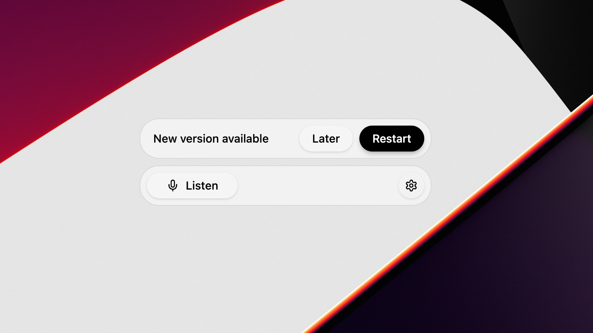
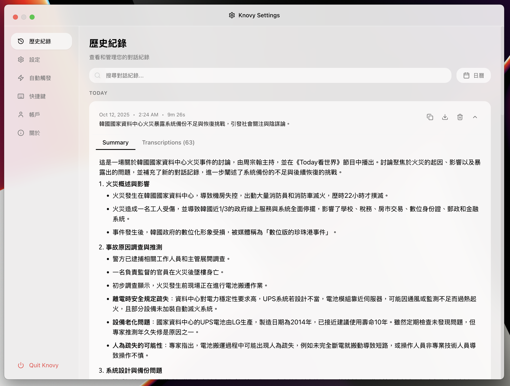
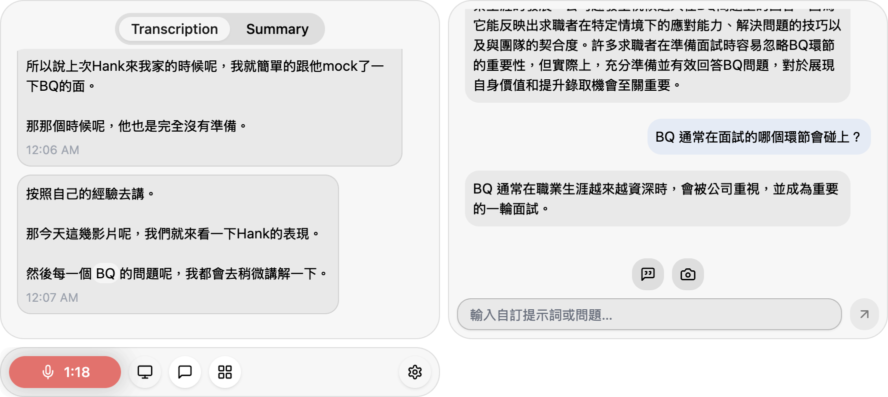

# Knovy

> Knovy started as an internal startup project in 2025. Over time, we stripped out all cloud infrastructure, removed the login gate, and made it **fully local and open source**. Everything runs on your machine — no accounts, no API keys, no telemetry. This will be a training ground project for the agentic tech stack.

Knovy is a local-first AI desktop assistant for real-time audio analysis, transcription, and AI-powered interactions. It runs **fully on your machine** — no cloud backend, no account, no API keys required.

<p align="center">
  
  <br/>Compact floating bar with auto-update notification
</p>

## Project Overview

Knovy is a single cross-platform **Electron** desktop application that combines local
**whisper.cpp** transcription with local **Ollama** AI actions to provide intelligent
assistance during meetings and conversations:

- Dual-stream audio capture (microphone + system audio)
- Offline speech-to-text via bundled whisper.cpp
- AI actions (summarize, chat, keyword search, screenshot analysis, deep response,
  recommendations) powered by a local Ollama server (`http://localhost:11434`)
- All persistence in a local SQLite database

There is **no cloud backend**. Earlier web, admin-dashboard, and Supabase components have
been removed; the repository is now a single-package Electron app.

## Repository Structure

A single-package Electron + Vite desktop application rooted at the repository root, managed
with **pnpm**.

```
/
├── src/                       # Electron app source
│   ├── main/                  # Main process (window mgmt, IPC, SQLite)
│   ├── renderer/              # React UI (renderer process)
│   └── preload/               # Secure IPC bridge
├── resources/                 # Bundled binaries (whisper.cpp, models)
├── code-signing/              # macOS signing / notarization scripts
├── tests/                     # Vitest tests
├── electron.vite.config.ts    # electron-vite build config
├── electron-builder.yml       # Packaging / publish config
└── package.json               # Single root manifest
```

## Quick Start

### Prerequisites

- Node.js v20 or later
- pnpm v10 or later
- Git
- (Optional) [Ollama](https://ollama.com/) running locally for AI actions

### Installation

1. **Clone the repository**

   ```bash
   git clone https://github.com/Intevia-AI/Knovy.git
   cd Knovy
   ```

2. **Install dependencies**

   ```bash
   pnpm install
   ```

3. **(Optional) Set up environment variables**

   The app runs without any cloud credentials. If you need to override defaults, copy
   `.env.example` to `.env`.

4. **Start development**

   ```bash
   pnpm dev
   ```

   The app will automatically download the small whisper model (~488MB) on first launch.

## Key Features

- **Local Transcription**: Privacy-focused speech-to-text using whisper.cpp (runs offline)
- **Dual-Stream Audio**: Simultaneous microphone and system audio capture
- **Two-Stage Language Detection**: Improved accuracy for Traditional Chinese
- **Progressive Enhancement**: Raw transcription displayed immediately, AI-enhanced version follows
- **AI Actions**: Summarize, chat, keyword search, screenshot analysis, deep response, recommendations — all via local Ollama
- **Chinese Language Support**: Automatic Traditional/Simplified conversion via OpenCC

## Architecture Highlights

- **Fully Local**: No backend; SQLite for storage, whisper.cpp for transcription, Ollama for AI
- **Progressive Enhancement**: ID-based updates prevent duplicate transcriptions
- **Chinese Language Support**: OpenCC integration for Traditional ↔ Simplified conversion
- **Release Management**: Automated builds and updates via GitHub Actions CI/CD

## Release Process

Desktop app releases are automated via GitHub Actions and published to this repository's
[Releases](https://github.com/Intevia-AI/Knovy/releases).

1. Update version in `package.json`
2. Create and push a git tag matching `v*.*.*`:
   ```bash
   git tag v0.3.9
   git push origin v0.3.9
   ```
3. The Release workflow builds, signs (macOS), and publishes the release.
4. The desktop app automatically notifies users of new versions.

**Code Signing**: Requires Apple Developer credentials in repository secrets (see `.github/workflows/release.yml`).

## Development Commands

```bash
pnpm install              # Install dependencies
pnpm dev                  # Start the desktop app in development
pnpm build:local          # Build locally (unsigned)
pnpm build                # Build the signed macOS app
pnpm format               # Format code with Prettier
pnpm test:run             # Run config/release tests (Vitest)
```

## Screenshots

<p align="center">
  
  <br/>Session history — browse and manage past recordings
</p>

<p align="center">
  
  <br/>Live recording view with real-time transcription and AI action panel
</p>

## Contributing

See [CONTRIBUTING.md](CONTRIBUTING.md) for development workflow, coding standards, and pull request process.
