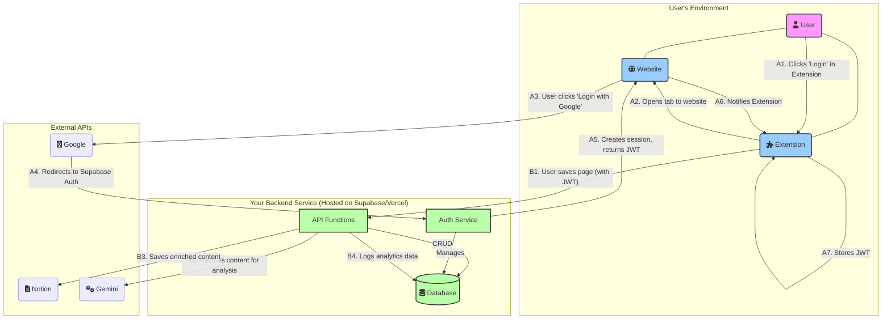
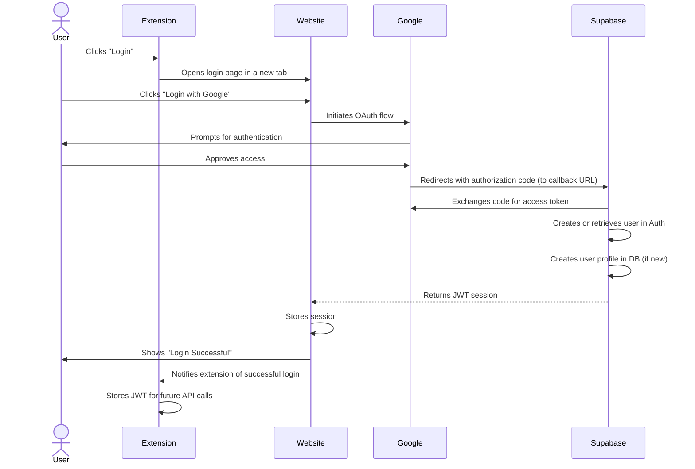

### **Project Blueprint: Building the "Secreterry" Online Service v2.0**

**Objective:** Evolve the Secreterry Chrome Extension from a local tool into a full-fledged online service. The architecture will be a monorepo containing a backend (Supabase), a frontend website, and the Chrome extension.

## System Architecture

## Signup & Login Flow

---

## Agent-Driven Execution

This project will be executed by a team of specialized AI agents. Each task in the following phases should be assigned to the appropriate agent to ensure consistency and quality.

- **`react-component-architect`**: For all React component development, including pages, UI elements, and hooks.
- **`backend-developer`**: For all backend tasks, including Supabase schema design, functions, and triggers.
- **`api-architect`**: For designing any new API endpoints or data contracts.
- **`tailwind-css-expert`**: For all styling and Tailwind CSS related tasks.
- **`frontend-developer`**: For general frontend tasks that don't fall under a more specific agent.

### **Phase 1: Core User Onboarding**

**Goal:** Implement a streamlined signup process where joining the beta is done by signing up directly with a Google account.

- **Task 1.1: Implement "Join with Google" Authentication.**

  - **1.1.1: Supabase Google OAuth Configuration:**
    - Enable Google as an OAuth provider in the Supabase project settings. This is a configuration step within the Supabase dashboard.
  - **1.1.2: Repurpose `Login.tsx` for Login:**
    - Modify `/Users/tweizh/DEV/Side-project/Secreterry/apps/website/src/pages/Login.tsx` to serve as the primary login page.
    - Change the main call-to-action to "Join Beta with Google".
    - Add a button that initiates the Google OAuth flow.
  - **1.1.3: Implement Supabase Authentication Flow (Frontend):**
    - In `Waitlist.tsx` (or a new authentication component), implement the logic to redirect the user to the Supabase Google OAuth URL.
    - Handle the callback from Supabase after Google authentication. This will involve extracting the JWT session from the URL or local storage.
    - Store the JWT securely in the browser (e.g., local storage or session storage).
  - **1.1.4: Implement Secure Logout Function:**
    - Create a `logout` function in the frontend that clears the JWT and redirects the user to a logged-out state or the login page.

- **Task 1.2: Create User Profiles & Collect Onboarding Info.**
  - **1.2.1: Create `profiles` table in Supabase:**
    - Define the schema for the `profiles` table in Supabase, including fields like `id` (linked to `auth.users`), `use_case`, `age_range`, etc.
  - **1.2.2: Automatic Profile Creation on First Login (Supabase Function/Trigger):**
    - Implement a Supabase function or database trigger that automatically creates a new entry in the `profiles` table whenever a new user is created in `auth.users`.
  - **1.2.3: Onboarding Form Implementation (Frontend):**
    - Create a new React component for the onboarding form.
    - This form will collect `use_case` and `age_range` (and any other desired initial profile information).
    - Implement logic to display this form _only_ after a user's first successful login (i.e., when their `profiles` entry is newly created or incomplete).
    - Implement logic to submit this form data to Supabase to update the `profiles` table.

### **Phase 2: Legal and Documentation**

**Goal:** Create the necessary legal documents and user documentation.

- **Task 2.1: Terms of Service and Privacy Policy.**

  1.  Create a "Terms of Service" page on the website.
  2.  Create a "Privacy Policy" page on the website.
  3.  These documents should clearly state what data is collected and how it is used.

- **Task 2.2: Notion Integration Documentation.**
  1.  Create a document explaining the benefits of the direct Notion integration and how it works.

### **Phase 3: Extension and Notion Integration**

**Goal:** Connect the Chrome extension to the backend and implement Notion integration.

- **Task 3.1: Refactor the Chrome Extension.**

  - **3.1.1: Modify Extension Login Button:**
    - Change the existing "Login" button in the extension's popup (`apps/extension/src/popup.tsx`) to open the website's login page (`Waitlist.tsx`).
  - **3.1.2: Implement Extension Listener for Login Event:**
    - In the extension's background script (`apps/extension/src/background.ts`) or content script (`apps/extension/src/content.ts`), implement a listener for messages from the website.
    - The website will send a message to the extension upon successful login, containing the JWT.
  - **3.1.3: Store JWT in Extension:**
    - Upon receiving the JWT from the website, securely store it within the extension's storage (e.g., `chrome.storage.local`).

- **Task 3.2: Notion Authentication.**
  - **3.2.1: Implement Notion OAuth (Frontend/Backend):**
    - This will likely involve a new page on the website where users can initiate the Notion OAuth flow.
    - The backend (Supabase Function) will handle the Notion OAuth callback, exchange the authorization code for an access token, and store it.
  - **3.2.2: Create `notion_tokens` table:**
    - Define the schema for a `notion_tokens` table in Supabase to securely store Notion access tokens, linked to the `profiles` table.
