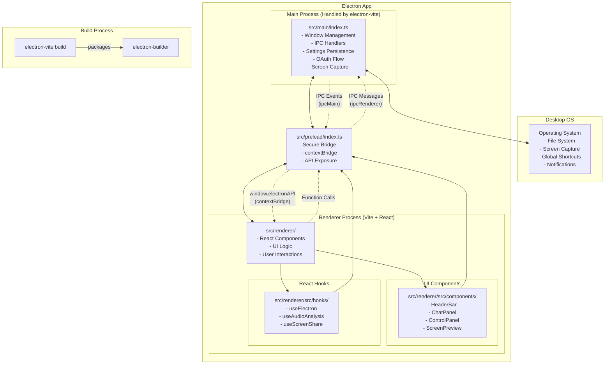

# Developer Guide: Intevia AI Desktop App (`apps/app_new`)

This guide provides a comprehensive overview of the Electron application in `apps/app_new`, its architecture, and how to develop, build, and extend it.

## 1. Overview

The desktop application is built using a combination of **Electron**, **Vite**, and **React**.

-   **Electron**: Serves as the application wrapper, providing access to native OS-level functionalities (e.g., windows, menus, screen capture). It runs the **Main Process**.
-   **electron-vite**: A build tool that provides a faster and leaner development experience for Electron, handling the main, preload, and renderer processes.
-   **Vite + React**: Powers the user interface. It runs as a web application inside an Electron browser window, known as the **Renderer Process**.

This architecture allows us to build a cross-platform desktop app using familiar web technologies with a modern and efficient build system.

## 2. Core Architecture & Key Files

The application is divided into two primary processes that communicate securely.



### Key Files

-   `src/main/index.ts`: **The Main Process Entry Point**. This is the heart of the Electron app. It controls the application lifecycle, creates `BrowserWindow` instances, handles native OS integrations, and sets up all Inter-Process Communication (IPC) listeners.
-   `src/preload/index.ts`: **The Secure Bridge**. This script runs in a privileged context and uses `contextBridge` to securely expose specific Main process functions to the UI.
-   `src/renderer/index.html`: **The Renderer Entry Point**. The main HTML file for the Vite application.
-   `electron.vite.config.ts`: **Electron-Vite Configuration**. Configures the entry points and build options for the main, preload, and renderer processes.

### Communication Flow (IPC)

1.  **UI (Renderer)**: A React component calls a function, for example, `window.electronAPI.minimizeWindow()`.
2.  **Preload Script**: The call is received. The preload script uses `ipcRenderer.send()` or `ipcRenderer.invoke()` to send a message to the Main process.
3.  **Main Process**: An `ipcMain.on()` or `ipcMain.handle()` listener in `src/main/index.ts` catches the message and executes the corresponding native Electron code.

## 3. Development Workflow

The development environment uses `electron-vite` to run the main, preload, and renderer processes with hot-reloading.

**Start the development environment:**

```bash
cd apps/app_new
pnpm dev
```

This single command will:
1.  Start the Vite development server for the renderer with hot-reloading for UI changes.
2.  Start the Electron main process, which loads the renderer from the dev server.
3.  Watch for changes in `src/main/index.ts` and `src/preload/index.ts` and restart the main process automatically.

## 4. How to Extend the Application

Here’s a step-by-step example of how to add a new feature: a button that resizes the main application window.

### Step 1: Add a Handler in the Main Process

Open `src/main/index.ts` and add a new `ipcMain` handler.

```typescript
// In src/main/index.ts
ipcMain.on("electronAPI:resizeWindow", (event, { width, height }) => {
  if (mainWindow) {
    mainWindow.setSize(width, height, true); // true for animated resize
  }
});
```

### Step 2: Expose the Function in the Preload Script

Open `src/preload/index.ts` and add the new function to the `api` object.

```typescript
// In src/preload/index.ts
const api = {
  // ... all other existing functions
  resizeWindow: (size: { width: number; height: number }) => ipcRenderer.send("electronAPI:resizeWindow", size),
};

contextBridge.exposeInMainWorld("electronAPI", api);
```

### Step 3: Call the Function from the UI

Now you can call this function from any React component in `src/renderer/src`.

```tsx
// In a React component
const handleResizeClick = () => {
  window.electronAPI?.resizeWindow({ width: 800, height: 600 });
};

return <button onClick={handleResizeClick}>Resize to 800x600</button>;
```

## 5. Building for Production

To build the application for distribution, run the build script from `package.json`.

```bash
cd apps/app_new
pnpm build
```

This script performs these main actions:
1.  **Builds the App**: Runs `electron-vite build` to compile and bundle the main, preload, and renderer code.
2.  **Packages the Application**: Uses `electron-builder` to package the application into a distributable format (e.g., `.dmg`, `.exe`).

The final application will be generated in the `apps/app_new/dist` directory.
