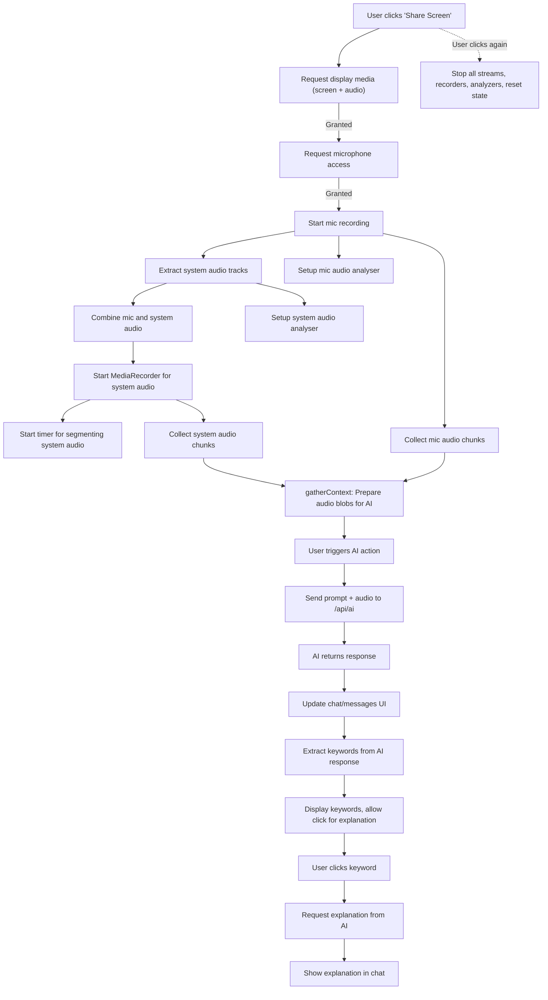

# Intevia AI Web (Demo Section)

## Overview

This web app is a demo interface for Intevia AI, designed to:

- Share your screen and record both microphone and system audio
- Provide real-time AI analysis and transcription
- Let users interact with AI for answers, summaries, and search
- Visualize audio and extract keywords in real time

## Architecture Summary

Intevia AI Web Demo uses two parallel audio processing flows:

- **Chunked Recording (DemoComponent):**

  - Records audio in blocks (chunks) for on-demand, context-aware AI actions (summary, Q&A, search).
  - Ensures robust, queryable, and accurate analysis by sending actual audio data to the backend when needed.

- **Streaming Analysis (RealTimeAnalysis):**
  - Streams audio live to the AI for instant transcription and keyword extraction.
  - Provides real-time feedback and live captions, but is not meant for deep, retrospective analysis.

## Workflow Diagram



## Detailed Workflow Steps

1. **User clicks 'Share Screen'**: The app requests permission to capture the screen (with system audio) and microphone.
2. **Streams are combined**: Microphone and system audio are combined and recorded. Audio analyzers are set up for real-time visualization.
3. **Audio chunking**: Both mic and system audio are chunked for later processing.
4. **AI interaction**: When the user triggers an AI action (answer, summary, search, or custom), the latest audio chunks are sent to the backend AI API.
5. **AI response**: The AI returns a response, which is displayed in the chat/messages UI. Keywords are extracted and shown.
6. **Keyword explanation**: Users can click on keywords to request simple explanations from the AI, which are then displayed in the chat.
7. **Stopping**: Clicking the share button again stops all streams, recorders, analyzers, and resets the state.

## RealTimeAnalysis Component

The `RealTimeAnalysis` component is responsible for real-time audio analysis, transcription, and keyword extraction. It captures audio from the microphone (and optionally system audio), streams it to the Gemini AI API, and provides live transcription and keyword updates to the UI.

**Key responsibilities:**

- Real-time transcription of audio input (mic and/or system audio)
- Extraction and display of keywords from the conversation
- Audio level visualization
- Integration with Gemini AI API via WebSocket
- Provides callbacks for text and keyword updates to the parent demo component

**How it fits in:**

- Used in the demo sidebar for live feedback and keyword suggestions
- Receives the current system audio stream (if available) from the main demo logic
- Notifies the main demo when new transcriptions or keywords are available

**Usage Example:**

```tsx
<RealTimeAnalysis
  onTextResponse={handleTextResponse}
  onKeywords={handleKeywords}
  systemAudioStream={currentSystemAudioStream}
/>
```

## Chunked Recording vs. Streaming Analysis: Detailed Comparison

| Feature           | Chunked Recording                | Streaming Analysis          |
| ----------------- | -------------------------------- | --------------------------- |
| Managed by        | DemoComponent                    | RealTimeAnalysis            |
| Data sent         | Discrete audio chunks            | Continuous audio stream     |
| Trigger           | User action (button click)       | Ongoing, as user speaks     |
| Use case          | On-demand Q&A, summary, search   | Live transcription/keywords |
| Latency           | Higher (wait for chunk + action) | Low (near-instant)          |
| Network tolerance | More robust                      | Needs stable connection     |

**Chunked Recording (DemoComponent):**

- Records audio in blocks (chunks), e.g., every 10 or 20 seconds, using the MediaRecorder API.
- Chunks are stored in memory. When the user clicks a button ("Summarize", "Answer", "Search"), the most recent chunk(s) are sent to the backend AI for analysis.
- On-demand, context-aware analysis. The AI gets a fixed window of recent audio to process a specific request.
- Not real-time: There’s a delay until the chunk is complete and the user triggers an action.
- Good for: Summaries, Q&A, or any analysis that needs a bounded, recent context.
- Robust: If the network is slow, you can retry sending the chunk.

**Streaming Analysis (RealTimeAnalysis):**

- Audio is captured and sent in small, continuous pieces (often via WebSocket) to the AI as soon as it’s available.
- As soon as the user starts real-time analysis, audio is streamed live to the backend for immediate processing.
- Real-time feedback: live transcription, keyword extraction, and instant UI updates.
- Minimal delay, user sees results as they speak.
- Good for: Live captions, instant keyword suggestions, and continuous feedback.
- Requires stable, low-latency connection.

**Why not just use streaming for everything?**

- Streaming is for live feedback, not for reliable context. It’s not designed to keep a reliable, complete, and queryable history of everything that was said.
- Chunked recording is robust and queryable. Stores actual audio data in memory, in discrete blocks. When you want a summary, answer, or search, you can send the exact, most recent audio chunks to the backend AI.
- Streaming transcription ≠ full context. Streaming transcription may miss words, have errors, or lose data if the connection drops. For high-quality summaries or Q&A, you want to send the actual audio (not just the live transcript) to the AI, so it can re-process with the best model/settings.

**Analogy:**

- Chunked: Like saving a voice memo every 20 seconds, then sending it to the AI when you want a summary or answer.
- Streaming: Like live captions on a video call—instant feedback, but not meant for deep, retrospective analysis.

**In short:**

- Streaming = live, but ephemeral and less reliable for deep analysis.
- Chunked = robust, queryable, and accurate for on-demand analysis.
- Both together = best UX: live feedback + reliable, high-quality on-demand AI.

## References

For more details, see the code in `components/demo.tsx` and `components/RealTimeAnalysis.tsx`.
