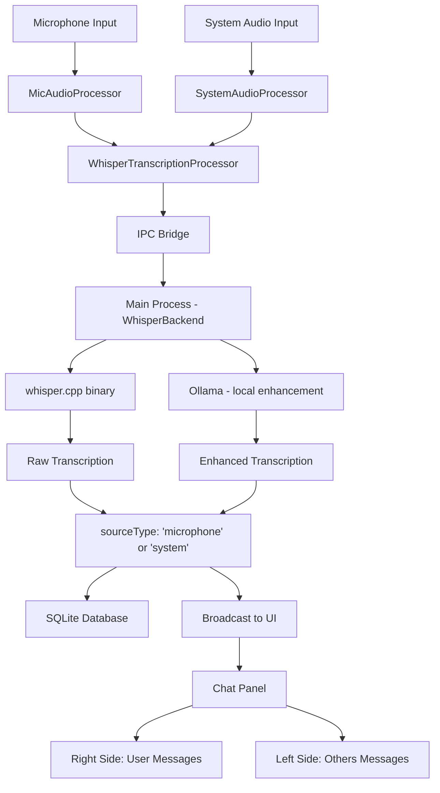
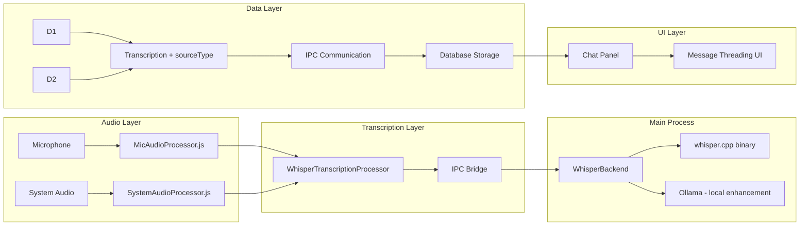

# Transcription Threading Architecture

## [Info]

- Last updated: 2025/09/23 by Archi
- AppliedVersion: `v0.2.3`

## 1. Overview

The Transcription Threading system enables real-time speaker identification and conversation flow by separating microphone and system audio into distinct processing threads. This creates a natural chat-like experience where users can differentiate between their own speech and others' speech during conversations.

## 2. Architecture Goals

- **Speaker Identification**: Distinguish between user speech (microphone) and others' speech (system audio)
- **Real-time Processing**: Parallel transcription without audio mixing artifacts
- **Chat-like UX**: Intuitive left/right message alignment similar to messaging apps
- **Scalability**: Foundation for multi-speaker scenarios and future enhancements
- **Backward Compatibility**: Seamless integration with existing transcription data

## 3. System Architecture

### 3.1 High-Level Flow



### 3.2 Component Architecture



## 4. Audio Processing Layer

### 4.1 Audio Worklets

#### MicAudioProcessor (`mic-audio-processor.js`)

```javascript
class MicAudioProcessor extends AudioWorkletProcessor {
  constructor(options) {
    super();
    this.sourceType = "microphone";
    this.bufferSize = 8192;
    this.silenceThreshold = 0.01;
  }

  process(inputs, outputs, parameters) {
    // Process audio and tag with sourceType
    this.port.postMessage({
      pcmData: pcmData.buffer,
      level: audioLevel,
      sourceType: this.sourceType, // Key differentiation
    });
  }
}
```

#### SystemAudioProcessor (`system-audio-processor.js`)

```javascript
class SystemAudioProcessor extends AudioWorkletProcessor {
  constructor(options) {
    super();
    this.sourceType = "system";
    // Identical processing logic but different sourceType
  }
}
```

**Key Features:**

- **Independent Processing**: Each worklet processes audio separately
- **Source Tagging**: Every audio chunk tagged with `sourceType`
- **Silence Detection**: Efficient bandwidth usage by filtering silent periods
- **PCM Conversion**: Standard 16-bit PCM format for whisper.cpp compatibility

### 4.2 Audio Pipeline Architecture

```
Microphone → MicAudioProcessor → Tagged Audio Chunks (sourceType: 'microphone')
System Audio → SystemAudioProcessor → Tagged Audio Chunks (sourceType: 'system')
```

## 5. Client Communication Layer

### 5.1 Transcription Processor Architecture

Both audio streams flow through a shared `WhisperTranscriptionProcessor` that tags each audio chunk with its `sourceType` before sending it over IPC to the main process:

```typescript
// WhisperTranscriptionProcessor processes audio from both worklets.
// Each chunk carries sourceType: 'microphone' | 'system'.
const processTranscriptionResponse = (
  text: string,
  sourceType: "microphone" | "system",
) => {
  onTextResponse(transcription, false, sourceType);
};
```

### 5.2 IPC Communication

Audio chunks are sent via IPC to the main process where `WhisperBackend` handles transcription:

```typescript
// Microphone pipeline
electronAPI.send("transcription:audio", {
  pcmData: chunk,
  sourceType: "microphone",
});

// System audio pipeline
electronAPI.send("transcription:audio", {
  pcmData: chunk,
  sourceType: "system",
});
```

**Benefits:**

- **Fault Isolation**: Issues with one stream don't affect the other
- **Parallel Processing**: Both streams processed simultaneously by whisper.cpp
- **Source Attribution**: `sourceType` is preserved through the entire pipeline
- **No Network Dependency**: All processing is local via IPC to the main process

## 6. IPC Communication Protocol

### 6.1 Enhanced Data Structure

```typescript
// Before: Simple string
electronAPI.send("transcription:data", text);

// After: Structured object with source attribution
electronAPI.send("transcription:data", {
  text: string,
  sourceType: "microphone" | "system",
});
```

### 6.2 Main Process Handler

```typescript
ipcMain.on(
  "transcription:data",
  (
    event,
    transcriptionData: {
      text: string;
      sourceType: "microphone" | "system";
    },
  ) => {
    const newTranscript = {
      id: generateUniqueId(),
      session_id: currentSessionId,
      timestamp: new Date().toISOString(),
      content: transcriptionData.text,
      sourceType: transcriptionData.sourceType, // Preserved through pipeline
      role: "assistant",
      type: "transcription",
    };

    // Save to database with source attribution
    dbService.addTranscript(newTranscript);

    // Broadcast to all renderer processes
    broadcastToWindows("transcription:data", newTranscript);
  },
);
```

## 7. Database Schema

### 7.1 Schema Evolution

```sql
-- Enhanced transcripts table
CREATE TABLE IF NOT EXISTS transcripts (
  id TEXT PRIMARY KEY,
  session_id TEXT,
  timestamp TEXT,
  content TEXT,
  source_type TEXT DEFAULT 'system', -- New field for speaker identification
  FOREIGN KEY (session_id) REFERENCES sessions (id)
);

-- Migration for existing data
ALTER TABLE transcripts ADD COLUMN source_type TEXT DEFAULT 'system';
```

### 7.2 Data Model

```typescript
interface TranscriptRecord {
  id: string;
  session_id: string;
  timestamp: string;
  content: string;
  source_type: "microphone" | "system"; // Speaker identification
}
```

**Design Decisions:**

- **Default to 'system'**: Ensures backward compatibility with existing transcripts
- **Simple Enum**: Easy to extend for future speaker types (user names, device IDs)
- **Indexed Fields**: Optimized queries by session and timestamp

## 8. User Interface Architecture

### 8.1 Message Threading UI

```tsx
// ChatPanel.tsx
{
  transcriptions.map((message) => {
    const isUserMessage = message.sourceType === "microphone";

    return (
      <motion.div
        key={message.id}
        className={cn(
          "p-2 rounded-md text-sm w-fit max-w-[95%]",
          isUserMessage
            ? "bg-blue-500/10 border border-blue-500/20 ml-auto" // Right side
            : "bg-black/5 border border-black/10 mr-auto", // Left side
        )}
      >
        <Markdown>{message.content}</Markdown>
      </motion.div>
    );
  });
}
```

### 8.2 Visual Design Pattern

```
┌─────────────────────────────────────────────┐
│ System Audio (Others)          [Gray/Left]  │
│                                             │
│                    [Blue/Right] User (Mic)  │
│                                             │
│ System Audio (Others)          [Gray/Left]  │
│                                             │
│                    [Blue/Right] User (Mic)  │
└─────────────────────────────────────────────┘
```

**UX Principles:**

- **Familiar Pattern**: Standard chat app left/right alignment
- **Visual Differentiation**: Color coding (blue for user, gray for others)
- **Responsive Design**: Messages adapt to content length
- **Smooth Animations**: Framer Motion for natural message appearance

## 9. Local Processing Architecture

Both audio streams are processed locally. There is no proxy server or cloud API:

```
MicAudioProcessor → IPC → WhisperBackend → whisper.cpp → sourceType: 'microphone'
SystemAudioProcessor → IPC → WhisperBackend → whisper.cpp → sourceType: 'system'
```

Each stream is tagged with `sourceType` at the worklet level and that tag is preserved throughout the entire pipeline (IPC → WhisperBackend → SQLite → UI).

## 10. Performance Characteristics

### 10.1 Resource Usage

| Component             | Before (Mixed) | After (Threaded) | Improvement            |
| --------------------- | -------------- | ---------------- | ---------------------- |
| Audio Processing      | 1 worklet      | 2 worklets       | Parallel processing    |
| IPC Channels          | 1 channel      | Tagged channel   | Source attribution     |
| whisper.cpp Calls     | Mixed input    | Tagged per call  | Independent processing |
| Database Writes       | Mixed records  | Tagged records   | Clear attribution      |
| UI Rendering          | Single thread  | Differentiated   | Better UX              |

### 10.2 Latency Analysis

```
Audio Capture → Worklet Processing → IPC → WhisperBackend → whisper.cpp → Response
     ~5ms           ~10ms           ~2ms        ~5ms          ~100-500ms
```

**Optimizations:**

- **Parallel Processing**: Both streams processed simultaneously
- **Efficient Buffering**: 8KB buffers minimize latency while ensuring quality
- **Silence Detection**: Reduces unnecessary processing
- **Local-only**: No network round-trip; all processing on-device

## 11. Error Handling & Resilience

### 11.1 Fault Isolation

```typescript
// Independent error handling per stream
try {
  electronAPI.send("transcription:audio", { pcmData: data, sourceType: "microphone" });
} catch (error) {
  console.error("Microphone stream error:", error);
  // System audio continues unaffected
}

try {
  electronAPI.send("transcription:audio", { pcmData: data, sourceType: "system" });
} catch (error) {
  console.error("System audio stream error:", error);
  // Microphone continues unaffected
}
```

### 11.2 Resilience Strategy

If whisper.cpp crashes or Ollama is unavailable, the worklets continue collecting audio. The main process logs errors and attempts recovery. Raw transcription is always shown if enhancement fails.

### 11.3 Graceful Degradation

| Failure Scenario       | System Behavior                | User Experience                 |
| ---------------------- | ------------------------------ | ------------------------------- |
| Microphone failure     | System audio continues         | Only others' speech transcribed |
| System audio failure   | Microphone continues           | Only user speech transcribed    |
| whisper.cpp crash      | Error logged, session paused   | Transcription stops temporarily |
| Ollama unavailable     | Raw transcription shown        | No enhancement, no AI actions   |
| Database failure       | UI continues, data queued      | Real-time display maintained    |

## 12. Security and Privacy Considerations

### 12.1 Data Isolation

- **Stream Separation**: Audio sources never mixed at processing level
- **Source Validation**: `sourceType` validated before database storage
- **IPC Security**: Structured message validation in main process

### 12.2 Privacy Protection

- **Fully Local**: All audio processing and transcription happens on-device — audio never leaves the machine
- **No Network Transmission**: whisper.cpp runs as a local binary; Ollama runs at localhost
- **User Control**: Users can disable either microphone or system audio

## 13. Future Enhancements

### 13.1 Multi-Speaker Support

The current architecture provides foundation for:

```typescript
interface EnhancedTranscription {
  sourceType: "microphone" | "system";
  speakerId?: string; // Future: Individual speaker identification
  deviceId?: string; // Future: Multiple microphone support
  confidence?: number; // Future: AI confidence scoring
}
```

### 13.2 Advanced Features

- **Speaker Recognition**: ML-based individual speaker identification
- **Voice Activity Detection**: More sophisticated silence detection
- **Audio Quality Metrics**: Real-time audio quality monitoring
- **Custom Audio Sources**: Support for external microphones/devices
- **Conversation Analytics**: Speaker time analysis, interruption detection

## 14. Migration & Deployment

### 14.1 Backward Compatibility

```sql
-- Existing transcripts automatically get source_type = 'system'
UPDATE transcripts SET source_type = 'system' WHERE source_type IS NULL;
```

### 14.2 Feature Rollout

1. **Phase 1**: Deploy new worklets and dual client architecture
2. **Phase 2**: Update UI to show message threading
3. **Phase 3**: Migrate existing data with default source types
4. **Phase 4**: Enable user configuration options

### 14.3 Monitoring

```typescript
// Performance metrics to track
interface TranscriptionMetrics {
  microphoneLatency: number;
  systemAudioLatency: number;
  transcriptionAccuracy: number;
  errorRates: {
    microphone: number;
    systemAudio: number;
    websocket: number;
  };
}
```

## 15. Conclusion

The Transcription Threading architecture successfully transforms a mixed-audio experience into an intuitive, chat-like conversation interface. By separating audio processing at the source level and maintaining isolation throughout the entire pipeline, the system provides clear speaker identification while maintaining high performance and reliability.

The modular design ensures scalability for future enhancements while preserving backward compatibility with existing data and workflows. The implementation leverages the local whisper.cpp + Ollama stack effectively, with all processing happening on-device.

**Key Achievements:**

- ✅ Clear speaker identification (user vs others)
- ✅ Intuitive chat-like interface
- ✅ Parallel processing for improved performance
- ✅ Fault isolation and resilience
- ✅ Backward compatibility maintained
- ✅ Foundation for future multi-speaker features
