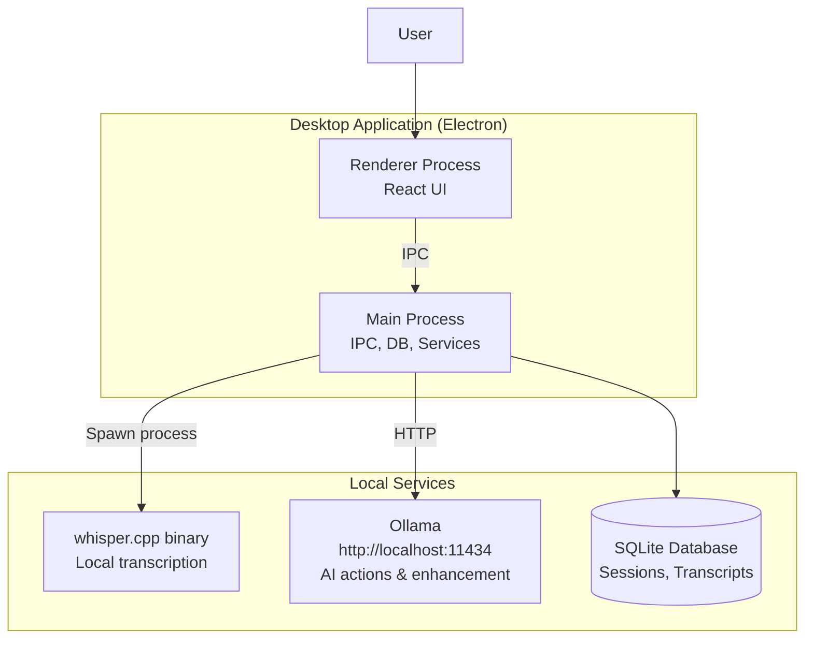
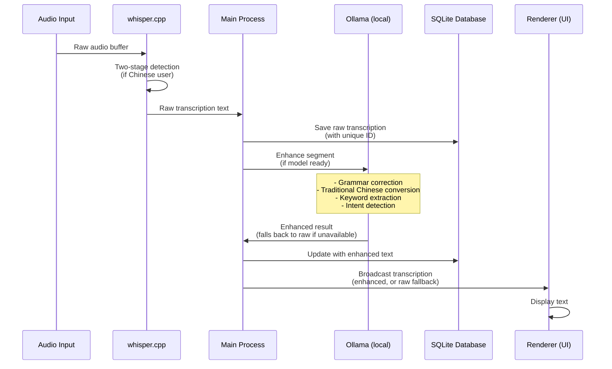

# Knovy Architecture Overview

## 1. Introduction

Knovy is a fully local AI meeting-assistant desktop application. It runs entirely on the user's machine — no accounts, no cloud backend, no API keys required. Transcription uses a bundled whisper.cpp binary; all AI actions use a locally-running Ollama instance.

## 2. System Architecture

There is no cloud backend. All components run on the user's machine.

### System Diagram



## 3. Application Components

### 3.1. Desktop Application (`apps/app`)

- **Framework**: Electron + React (using Vite).
- **Core Functionality**: Provides the full Knovy experience, including real-time audio capture, local transcription, transcription enhancement, and AI actions. No account or internet connection required.
- **Transcription Architecture**:
  - **Local Speech-to-Text**: Uses whisper.cpp binaries running directly on the user's machine for privacy and offline capability.
  - **Model Management**: Automatically downloads and manages whisper models (default: base model, 142MB).
  - **Two-Stage Language Detection**:
    - Stage 1: Detects the spoken language using `--detect-language` flag.
    - Stage 2: Performs targeted transcription with detected language for improved accuracy.
    - Particularly beneficial for Traditional Chinese (zh-TW) users.
  - **Dual Audio Streams**: Captures both microphone and system audio simultaneously, each processed independently.
  - **Local Transcription Enhancement**:
    - Raw transcription is enhanced on-device by a local Ollama model in the main process before being sent to the UI.
    - Enhancement covers grammar correction, Traditional Chinese conversion, and keyword extraction.
    - If the model is unavailable, the raw transcription is shown unchanged (best-effort, never blocking).
- **All AI Actions** (chat, summarize, recommend, deep, keyword search, screenshot analysis) run locally via Ollama at `http://localhost:11434`. No cloud API calls are made.
- **Local Storage**: SQLite database stores both raw and enhanced transcriptions with metadata.

## 4. Local Services

The app depends only on local services:

- **whisper.cpp**: Bundled binary, spawned as a child process by the main process. Handles all speech-to-text. No network access.
- **Ollama** (`http://localhost:11434`): Optional local LLM server. Used for transcription enhancement and all AI actions. If unavailable, raw transcriptions are shown and AI actions are disabled.
- **SQLite**: Embedded database in the app's user-data directory. Stores sessions, transcripts (raw + enhanced), and metadata.

## 5. Transcription Enhancement Architecture

The desktop application implements a sophisticated transcription enhancement system that provides immediate feedback while asynchronously improving transcription quality.

### Enhancement Flow



### Key Features

1. **ID-Based Updates**: Each transcript has a unique ID used consistently across the entire flow (database → UI → enhancement), ensuring enhanced text replaces the correct raw text without creating duplicates.

2. **Two-Stage Language Detection**:
   - **Stage 1**: Runs `whisper.cpp --detect-language` to identify spoken language
   - **Stage 2**: If Chinese detected for zh-TW user, runs targeted transcription with `--language zh`
   - Improves accuracy for Traditional Chinese users by providing language context to whisper

3. **Local Enhancement**: Each segment is enhanced by a local Ollama model in the main process — no network round-trip, no API cost, and no entitlement check. Enhancement runs per segment (the earlier Gemini-based batching was removed).

4. **Graceful Fallback**: If the Ollama model is not ready, the raw transcription is displayed unchanged; enhancement is best-effort and never blocks display.

### Database Schema

SQLite tables store both raw and enhanced transcriptions:

```sql
CREATE TABLE transcripts (
  id TEXT PRIMARY KEY,
  session_id TEXT NOT NULL,
  content TEXT NOT NULL,              -- Initially raw, updated to enhanced
  raw_text TEXT,                      -- Original whisper output
  enhanced_text TEXT,                 -- Ollama-enhanced version
  detected_language TEXT,             -- From two-stage detection
  enhancement_status TEXT DEFAULT 'pending',
  enhancement_metadata TEXT,          -- JSON: keywords, intention, confidence
  source_type TEXT,                   -- 'microphone' or 'system'
  timestamp INTEGER NOT NULL,
  created_at TEXT NOT NULL,
  enhancement_updated_at TEXT
);
```

### User Language Context Flow

The user's preferred language (from local app settings) flows through the entire transcription pipeline:

1. **App Settings** → Contains `profile.language` or `app_settings.language` (stored locally)
2. **RealTimeAnalysis Component** → Extracts user language from local settings
3. **TranscriptionFactory** → Passes `userLanguage` to processor configuration
4. **WhisperBackend** → Uses `userLanguage` to determine if two-stage detection is needed
5. **Enhancement Service** → Uses `userLanguage` for Traditional Chinese conversion

This ensures consistent language handling from audio capture to enhanced transcription display.
