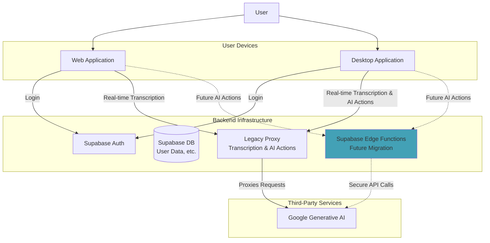

# Knovy Architecture Overview

## 1. Introduction

Knovy is an AI assistant platform composed of a desktop application, a web-based demo, and a robust backend. This document provides a high-level overview of the system architecture, focusing on its target state which is designed for security, efficiency, and scalability.

## 2. Current Architecture & Future Plans

The project currently uses a monolithic proxy server (`apps/proxy`) for real-time transcription, while leveraging Supabase for authentication and database services.

The immediate future plan is to migrate all stateless AI actions (e.g., summarization, custom queries) away from the proxy and into secure **Supabase Edge Functions**. This will improve security, efficiency, and maintainability.

### System Diagram (Current)

## 3. Application Components

### 3.1. Desktop Application (`apps/app`)

- **Framework**: Electron + React (using Vite).
- **Core Functionality**: Provides the full Knovy experience, including real-time audio capture, transcription, and AI actions.
- **Backend Interaction**:
  - **Authentication**: Uses Supabase for user login (OAuth).
  - **All Backend Logic**: Currently connects to the central WebSocket proxy (`apps/proxy`) for both real-time transcription and other AI actions.

### 3.2. Web Application (`apps/web`)

- **Framework**: Next.js.
- **Core Functionality**: Serves as the project's public-facing website and provides a demo of the real-time transcription feature.
- **Backend Interaction**:
  - **Authentication**: Uses Supabase for user login.
  - **Real-time Transcription**: Connects to the central WebSocket proxy (`apps/proxy`).

### 3.3. Backend Services

Our backend is composed of several key pieces:

- **Supabase**: The core of our backend for non-real-time tasks.
  - **Auth**: Manages all user authentication and provides JWTs.
  - **Database**: A PostgreSQL database for storing user data, application state, etc.
  - **Edge Functions (Future)**: The target for migrating all stateless AI actions (e.g., summarization) to secure, serverless functions.

- **Proxy Server (`apps/proxy`)**: The original WebSocket proxy. It currently handles all real-time transcription and AI actions for both the desktop and web applications. It will be simplified in the future to handle only real-time transcription.
