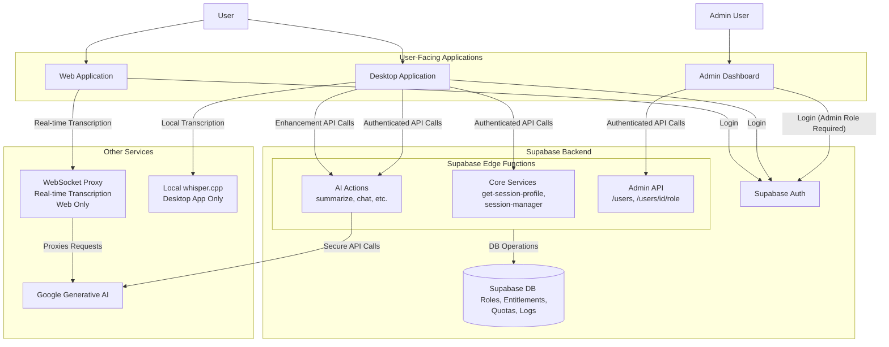
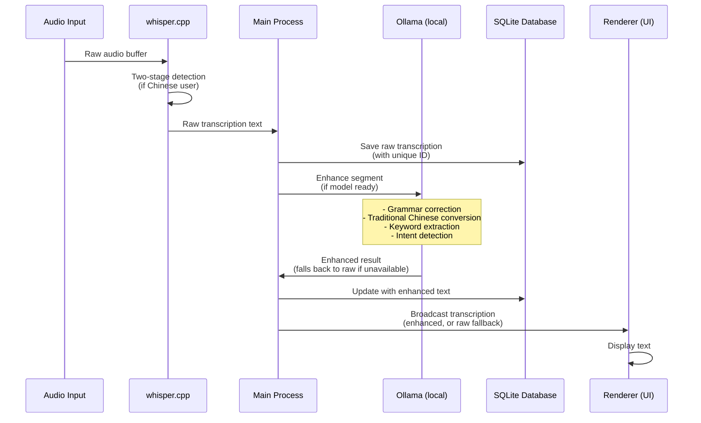

# Knovy Architecture Overview

## 1. Introduction

Knovy is an AI assistant platform composed of a desktop application, a web-based demo, an admin dashboard, and a robust backend. This document provides a high-level overview of the system architecture, which is designed for security, efficiency, and scalability using a modern, serverless approach.

## 2. System Architecture

The project leverages Supabase for its core backend infrastructure, including authentication, database services, and secure serverless functions. A sophisticated Role-Based Access Control (RBAC) and entitlements system is implemented to manage user permissions, features, and usage quotas.

### System Diagram



## 3. Application Components

### 3.1. Desktop Application (`apps/app`)

- **Framework**: Electron + React (using Vite).
- **Core Functionality**: Provides the full Knovy experience, including real-time audio capture, local transcription, transcription enhancement, and AI actions.
- **Transcription Architecture**:
  - **Local Speech-to-Text**: Uses whisper.cpp binaries running directly on the user's machine for privacy and offline capability.
  - **Model Management**: Automatically downloads and manages whisper models (default: base model, 142MB).
  - **Two-Stage Language Detection**:
    - Stage 1: Detects the spoken language using `--detect-language` flag.
    - Stage 2: Performs targeted transcription with detected language for improved accuracy.
    - Particularly beneficial for Traditional Chinese (zh-TW) users.
  - **Dual Audio Streams**: Captures both microphone and system audio simultaneously, each processed independently.
  - **Local Transcription Enhancement**:
    - Raw transcription is enhanced on-device by a local Ollama model in the main process before being sent to the UI.
    - Enhancement covers grammar correction, Traditional Chinese conversion, and keyword extraction.
    - If the model is unavailable, the raw transcription is shown unchanged (best-effort, never blocking).
- **Backend Interaction**:
  - **Authentication**: Uses Supabase for user login (OAuth).
  - **Session Management**: On startup, it calls the `get-session-profile` Edge Function to fetch the user's role, entitlements, and quotas, which dynamically configures the UI.
  - **AI Actions**: Connects to secure Supabase Edge Functions (e.g., `ai-action-summarize`, `ai-action-chat`), which are protected by the entitlements middleware.
  - **Transcription Enhancement**: Runs locally via Ollama in the main process — no network call (see Section 5).
  - **Local Storage**: SQLite database stores both raw and enhanced transcriptions with metadata.

### 3.2. Web Application (`apps/web`)

- **Framework**: Next.js.
- **Core Functionality**: Serves as the project's public-facing website and provides a demo of the real-time transcription feature.
- **Backend Interaction**:
  - **Authentication**: Uses Supabase for user login.
  - **Real-time Transcription**: Connects to the WebSocket proxy (`apps/proxy`).

### 3.3. Admin Dashboard (`apps/admin-dashboard`)

- **Framework**: Next.js.
- **Purpose**: An internal tool for administrators to manage the Knovy platform. It is deployed to a restricted subdomain for security.
- **Features**:
  - **User Management**: List all registered users and view their assigned roles.
  - **Role Assignment**: Change a user's role (e.g., from `free` to `pro`).
  - **Usage Auditing**: View the action logs for any specific user.
- **Authentication and Security**:
  - Access is strictly limited to users with the `admin` role.
  - On load, the application fetches the user's session profile. If the user does not have the `admin` role, they are redirected.
  - All API calls are sent to the `admin-api` Edge Function and are validated on the server.

## 4. Backend Services

Our backend is composed of several key pieces:

- **Supabase**: The serverless core of our backend.
  - **Auth**: Manages all user authentication (including OAuth) and provides JWTs for secure API access.
  - **Database**: A PostgreSQL database storing all application data, including the RBAC tables (`roles`, `entitlements`, `quotas`) and usage logs (`action_logs`, `transcription_ledger`).
  - **Edge Functions**: Secure, serverless Deno functions that host all application logic.
    - **Core Services**: Functions like `get-session-profile` that provide essential data to clients.
    - **AI Actions**: A suite of functions that perform specific AI tasks, each protected by the `withEntitlements` middleware to enforce RBAC and quotas.
    - **Admin API**: A dedicated API for platform management, restricted to admin users.

- **WebSocket Proxy (`apps/proxy`)**: A Node.js server that handles real-time, stateful WebSocket connections for features like live transcription. It proxies requests to the Google Generative AI API. **Note**: Currently used by the web application only; the desktop application uses local whisper.cpp transcription.

## 5. Transcription Enhancement Architecture

The desktop application implements a sophisticated transcription enhancement system that provides immediate feedback while asynchronously improving transcription quality.

### Enhancement Flow



### Key Features

1. **ID-Based Updates**: Each transcript has a unique ID used consistently across the entire flow (database → UI → enhancement), ensuring enhanced text replaces the correct raw text without creating duplicates.

2. **Two-Stage Language Detection**:
   - **Stage 1**: Runs `whisper.cpp --detect-language` to identify spoken language
   - **Stage 2**: If Chinese detected for zh-TW user, runs targeted transcription with `--language zh`
   - Improves accuracy for Traditional Chinese users by providing language context to whisper

3. **Local Enhancement**: Each segment is enhanced by a local Ollama model in the main process — no network round-trip, no API cost, and no entitlement check. Enhancement runs per segment (the earlier Gemini-based batching was removed).

4. **Graceful Fallback**: If the Ollama model is not ready, the raw transcription is displayed unchanged; enhancement is best-effort and never blocks display.

### Database Schema

SQLite tables store both raw and enhanced transcriptions:

```sql
CREATE TABLE transcripts (
  id TEXT PRIMARY KEY,
  session_id TEXT NOT NULL,
  content TEXT NOT NULL,              -- Initially raw, updated to enhanced
  raw_text TEXT,                      -- Original whisper output
  enhanced_text TEXT,                 -- Ollama-enhanced version
  detected_language TEXT,             -- From two-stage detection
  enhancement_status TEXT DEFAULT 'pending',
  enhancement_metadata TEXT,          -- JSON: keywords, intention, confidence
  source_type TEXT,                   -- 'microphone' or 'system'
  timestamp INTEGER NOT NULL,
  created_at TEXT NOT NULL,
  enhancement_updated_at TEXT
);
```

### User Language Context Flow

The user's preferred language (from session profile) flows through the entire transcription pipeline:

1. **Session Profile** → Contains `profile.language` or `app_settings.language`
2. **RealTimeAnalysis Component** → Extracts user language from session profile
3. **TranscriptionFactory** → Passes `userLanguage` to processor configuration
4. **WhisperBackend** → Uses `userLanguage` to determine if two-stage detection is needed
5. **Enhancement Service** → Uses `userLanguage` for Traditional Chinese conversion

This ensures consistent language handling from audio capture to enhanced transcription display.
