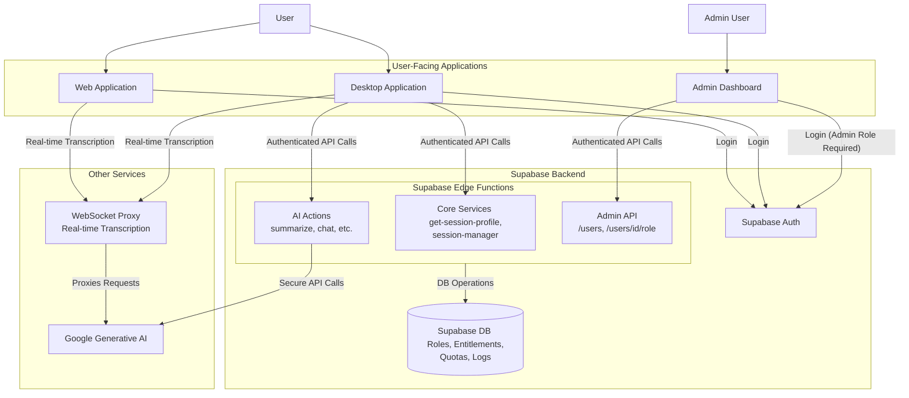

# Knovy Architecture Overview

## 1. Introduction

Knovy is an AI assistant platform composed of a desktop application, a web-based demo, an admin dashboard, and a robust backend. This document provides a high-level overview of the system architecture, which is designed for security, efficiency, and scalability using a modern, serverless approach.

## 2. System Architecture

The project leverages Supabase for its core backend infrastructure, including authentication, database services, and secure serverless functions. A sophisticated Role-Based Access Control (RBAC) and entitlements system is implemented to manage user permissions, features, and usage quotas.

### System Diagram

## 3. Application Components

### 3.1. Desktop Application (`apps/app`)

- **Framework**: Electron + React (using Vite).
- **Core Functionality**: Provides the full Knovy experience, including real-time audio capture, transcription, and AI actions.
- **Backend Interaction**:
  - **Authentication**: Uses Supabase for user login (OAuth).
  - **Session Management**: On startup, it calls the `get-session-profile` Edge Function to fetch the user's role, entitlements, and quotas, which dynamically configures the UI.
  - **AI Actions**: Connects to secure Supabase Edge Functions (e.g., `ai-action-summarize`), which are protected by the entitlements middleware.
  - **Real-time Transcription**: Connects to the WebSocket proxy (`apps/proxy`).

### 3.2. Web Application (`apps/web`)

- **Framework**: Next.js.
- **Core Functionality**: Serves as the project's public-facing website and provides a demo of the real-time transcription feature.
- **Backend Interaction**:
  - **Authentication**: Uses Supabase for user login.
  - **Real-time Transcription**: Connects to the WebSocket proxy (`apps/proxy`).

### 3.3. Admin Dashboard (`apps/admin-dashboard`)

- **Framework**: Next.js.
- **Purpose**: An internal tool for administrators to manage the Knovy platform. It is deployed to a restricted subdomain for security.
- **Features**:
  - **User Management**: List all registered users and view their assigned roles.
  - **Role Assignment**: Change a user's role (e.g., from `free` to `pro`).
  - **Usage Auditing**: View the action logs for any specific user.
- **Authentication and Security**:
  - Access is strictly limited to users with the `admin` role.
  - On load, the application fetches the user's session profile. If the user does not have the `admin` role, they are redirected.
  - All API calls are sent to the `admin-api` Edge Function and are validated on the server.

## 4. Backend Services

Our backend is composed of several key pieces:

- **Supabase**: The serverless core of our backend.
  - **Auth**: Manages all user authentication (including OAuth) and provides JWTs for secure API access.
  - **Database**: A PostgreSQL database storing all application data, including the RBAC tables (`roles`, `entitlements`, `quotas`) and usage logs (`action_logs`, `transcription_ledger`).
  - **Edge Functions**: Secure, serverless Deno functions that host all application logic.
    - **Core Services**: Functions like `get-session-profile` that provide essential data to clients.
    - **AI Actions**: A suite of functions that perform specific AI tasks, each protected by the `withEntitlements` middleware to enforce RBAC and quotas.
    - **Admin API**: A dedicated API for platform management, restricted to admin users.

- **WebSocket Proxy (`apps/proxy`)**: A Node.js server that handles real-time, stateful WebSocket connections for features like live transcription. It proxies requests to the Google Generative AI API.
