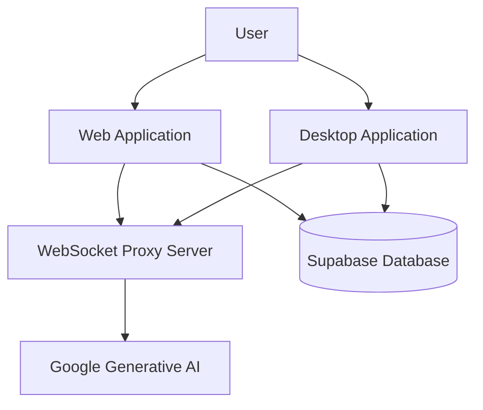

# System Architecture Overview

This document provides a comprehensive overview of the Intevia AI system architecture, explaining how the different components interact and work together.

## System Components

The Intevia AI project consists of three main applications:

1. **Web Application** (Next.js)
2. **Desktop Application** (Electron)
3. **WebSocket Proxy Server**

### High-Level Architecture



## Component Details

### Web Application (Next.js)

The web application provides a browser-based interface for users to interact with the AI capabilities.

**Key Technologies:**
- Next.js 14+ (React framework)
- TypeScript
- Tailwind CSS
- React Hooks for state management

**Main Components:**
- Landing page and marketing content
- Authentication system (via Supabase)
- Real-time audio processing
- AI interaction interface
- Feedback collection system

**Directory Structure:**
```
apps/web/
├── app/              # Next.js App Router
│   ├── (landing)/    # Landing page routes
│   ├── api/          # API routes
│   └── auth/         # Authentication routes
├── components/       # React components
├── hooks/            # Custom React hooks
├── lib/              # Utility functions
└── public/           # Static assets
```

### Desktop Application (Electron)

The desktop application provides a native experience with additional capabilities like screen sharing and system integration.

**Key Technologies:**
- Electron
- Next.js (for UI)
- TypeScript
- Native system APIs

**Main Components:**
- Screen sharing and recording
- System tray integration
- Native notifications
- Offline capabilities
- Audio processing

**Directory Structure:**
```
apps/app/
├── app/              # Next.js App Router
├── components/       # React components
├── context/          # React context providers
├── electron/         # Electron main process
├── hooks/            # Custom React hooks
└── lib/              # Utility functions
```

### WebSocket Proxy Server

The proxy server handles real-time communication between the client applications and the Google Generative AI API, managing streaming responses and connection state.

**Key Technologies:**
- Node.js
- WebSocket
- Google Generative AI SDK

**Main Responsibilities:**
- Maintain persistent connections to clients
- Handle authentication and rate limiting
- Stream AI responses in real-time
- Manage connection state and reconnection logic

**Directory Structure:**
```
apps/proxy/
├── startProxy.js     # Main server entry point
└── Dockerfile        # Container configuration
```

## Data Flow

### AI Interaction Flow

1. User initiates an AI interaction (text or voice)
2. Client application (web or desktop) processes the input
3. Input is sent to the WebSocket proxy server
4. Proxy server forwards the request to Google Generative AI
5. AI generates a response and streams it back through the proxy
6. Client application receives and displays the streaming response
7. Interaction is optionally logged to the database

### Authentication Flow

1. User logs in through the web or desktop application
2. Authentication request is sent to Supabase
3. Supabase validates credentials and returns a session token
4. Client application stores the session token
5. Subsequent requests include the session token for authorization

## Shared Components

The project uses a monorepo structure with shared packages:

### UI Component Library

Located in `packages/ui/`, this package contains reusable UI components used across both web and desktop applications.

### TypeScript Configuration

Located in `packages/typescript-config/`, this package provides shared TypeScript configurations to ensure consistency across all applications.

### ESLint Configuration

Located in `packages/eslint-config/`, this package provides shared linting rules to maintain code quality standards.

## Infrastructure Architecture

### Development Environment

- Local development using Next.js development server
- Local WebSocket proxy server
- Optional local Docker containers

### Production Environment

- Web application deployed to a cloud provider (Vercel, AWS, etc.)
- WebSocket proxy server deployed as a containerized service
- Desktop application distributed through app stores or direct download

## Security Considerations

- API keys and secrets are stored in environment variables, never in code
- Authentication handled by Supabase with proper JWT implementation
- HTTPS/WSS used for all communications
- Input validation on all user inputs
- Rate limiting on API endpoints

## Performance Considerations

- Streaming responses for real-time AI interactions
- Optimized audio processing for low latency
- Efficient state management to minimize re-renders
- Lazy loading of components and assets

## Future Architecture Considerations

- Scaling the WebSocket proxy server with a load balancer
- Implementing a caching layer for common AI responses
- Adding support for multiple AI providers
- Enhancing offline capabilities in the desktop application

## Related Documentation

- [API Reference](./api-reference.md)
- [Database Schema](./database-schema.md)
- [Authentication Flow](./authentication-flow.md)