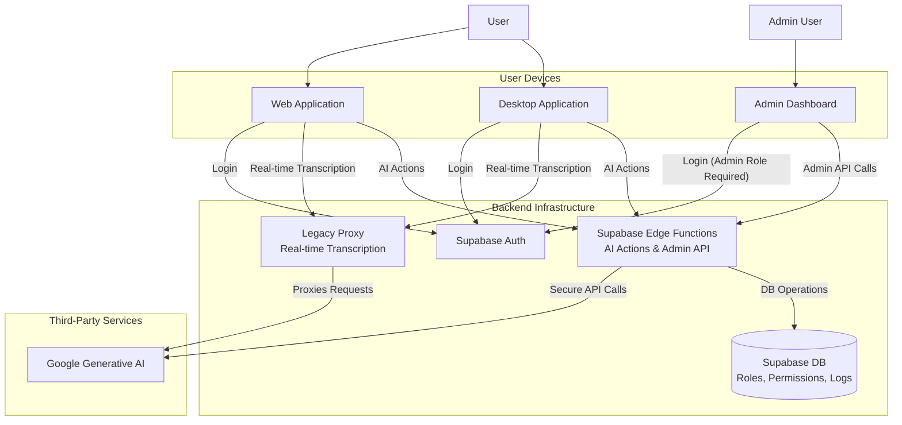

# Knovy Architecture Overview

## 1. Introduction

Knovy is an AI assistant platform composed of a desktop application, a web-based demo, an admin dashboard, and a robust backend. This document provides a high-level overview of the system architecture, which is designed for security, efficiency, and scalability.

## 2. Architecture & RBAC

The project leverages Supabase for authentication, database services, and secure serverless functions. A Role-Based Access Control (RBAC) system is implemented to manage user permissions and protect administrative functions.

All stateless AI actions and administrative tasks are handled by secure **Supabase Edge Functions**, which are protected by a custom RBAC middleware.

### System Diagram

## 3. Application Components

### 3.1. Desktop Application (`apps/app`)

- **Framework**: Electron + React (using Vite).
- **Core Functionality**: Provides the full Knovy experience, including real-time audio capture, transcription, and AI actions.
- **Backend Interaction**:
  - **Authentication**: Uses Supabase for user login (OAuth).
  - **AI Actions**: Connects to secure Supabase Edge Functions, which are protected by RBAC.
  - **Real-time Transcription**: Connects to the legacy WebSocket proxy (`apps/proxy`).

### 3.2. Web Application (`apps/web`)

- **Framework**: Next.js.
- **Core Functionality**: Serves as the project's public-facing website and provides a demo of the real-time transcription feature.
- **Backend Interaction**:
  - **Authentication**: Uses Supabase for user login.
  - **Real-time Transcription**: Connects to the legacy WebSocket proxy (`apps/proxy`).

### 3.3. Admin Dashboard (`apps/admin-dashboard`)

- **Framework**: Next.js.
- **Purpose**: An internal tool for administrators to manage the Knovy platform. It is deployed as a separate application to a restricted subdomain (e.g., `admin.knovy.app`) for security.
- **Features**:
    - **User Management**: List all registered users and view their assigned roles.
    - **Role Assignment**: Change a user's role (e.g., from `free` to `pro` or `admin`).
    - **Usage Auditing**: View the action logs for any specific user to monitor their activity.
- **Authentication and Security**:
    - Access is strictly limited to users with the `admin` role.
    - Admins log in using the standard Supabase authentication flow.
    - On load, the application calls the `/me/permissions` endpoint. If the user does not have admin permissions, they are immediately redirected away from the dashboard.
    - All API calls from the dashboard are sent with the admin's JWT and are validated on the server by the RBAC middleware in the Edge Functions.

### 3.4. Backend Services

Our backend is composed of several key pieces:

- **Supabase**: The core of our backend.
  - **Auth**: Manages all user authentication and provides JWTs for secure API access.
  - **Database**: A PostgreSQL database storing user data, application state, and all RBAC-related tables (`roles`, `permissions`, `role_permissions`, `action_logs`).
  - **Edge Functions**: Secure, serverless functions that host all application logic, including AI actions and the Admin API. All functions are protected by a shared RBAC middleware to enforce permissions.

- **Proxy Server (`apps/proxy`)**: A legacy WebSocket proxy that currently handles real-time transcription. In the future, this functionality will also be migrated to a more robust, scalable solution.