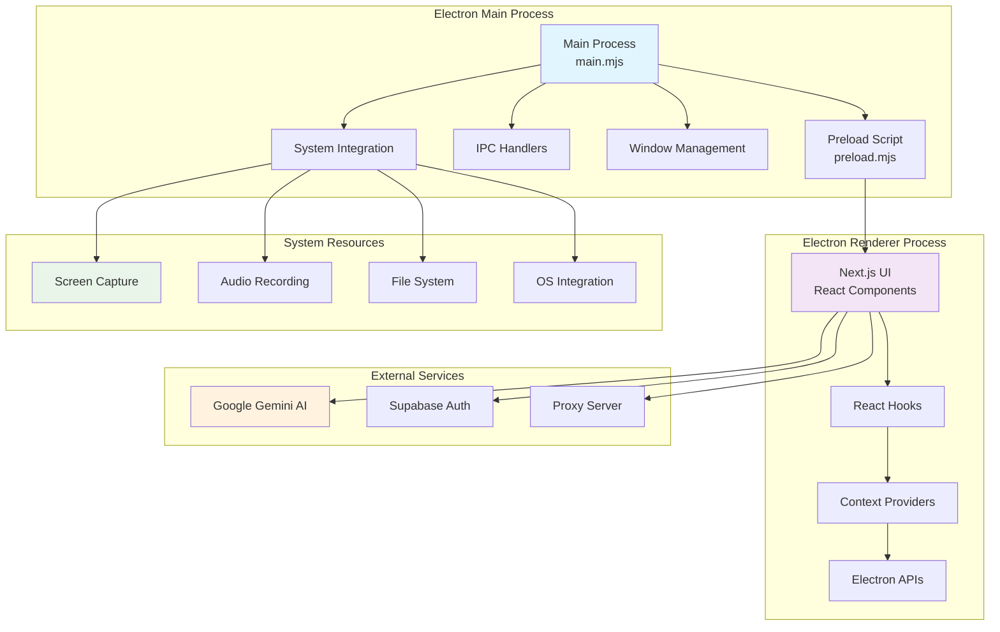
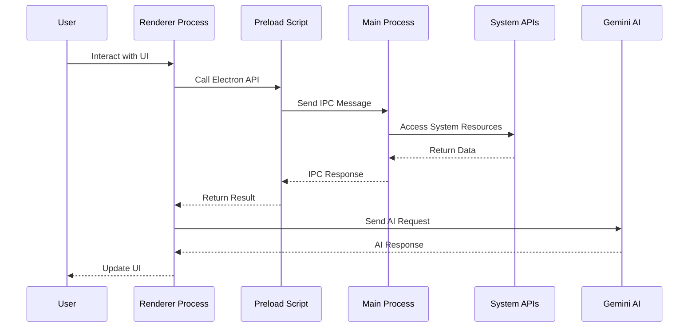
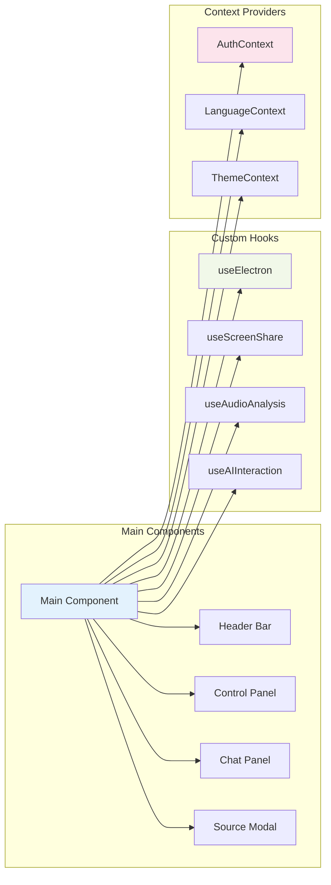
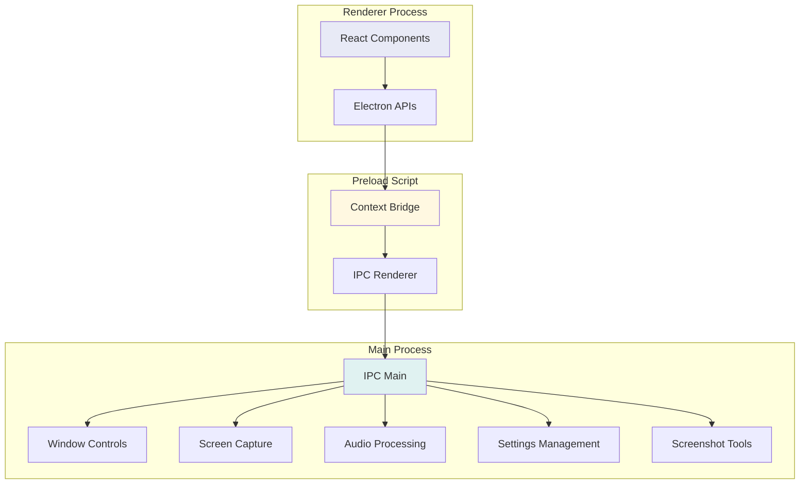

# Electron App Architecture Diagram

> > [!IMPORTANT]
> > This document is AI generated. Please verify the information before using it.

## Overall Architecture

## Component Flow Diagram

## Key Components Detail

## IPC Communication Flow

