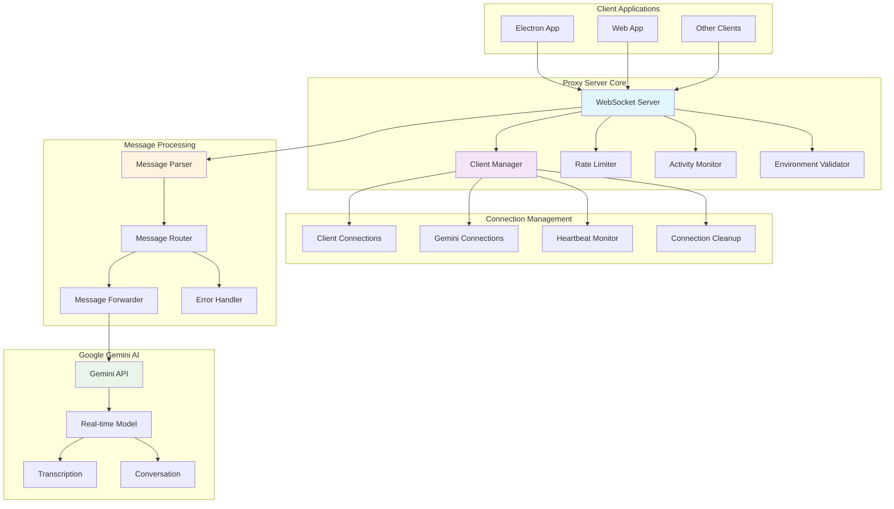
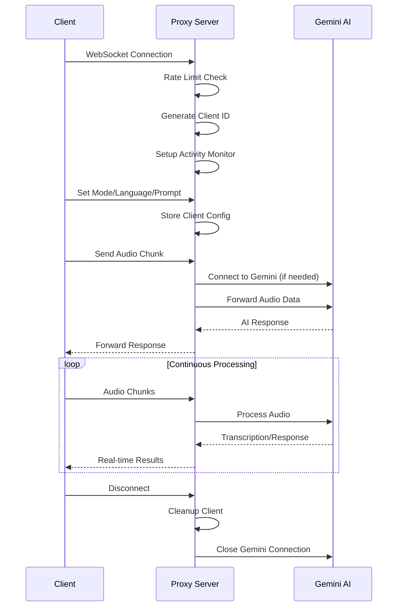
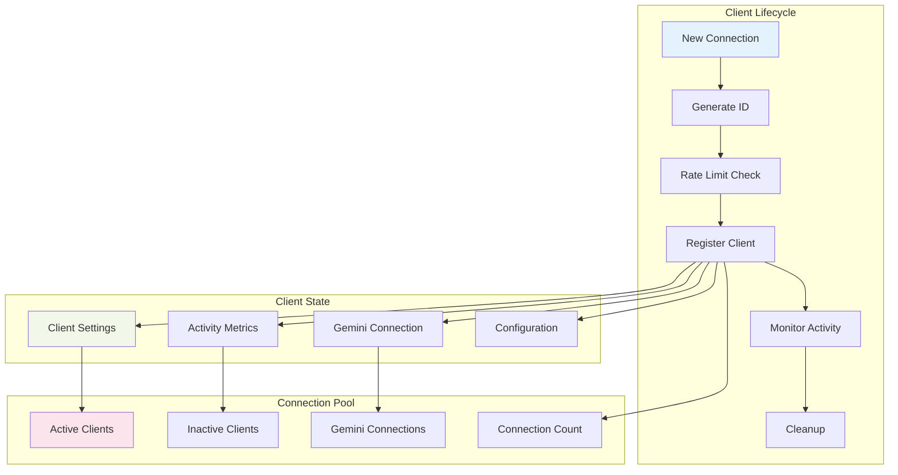
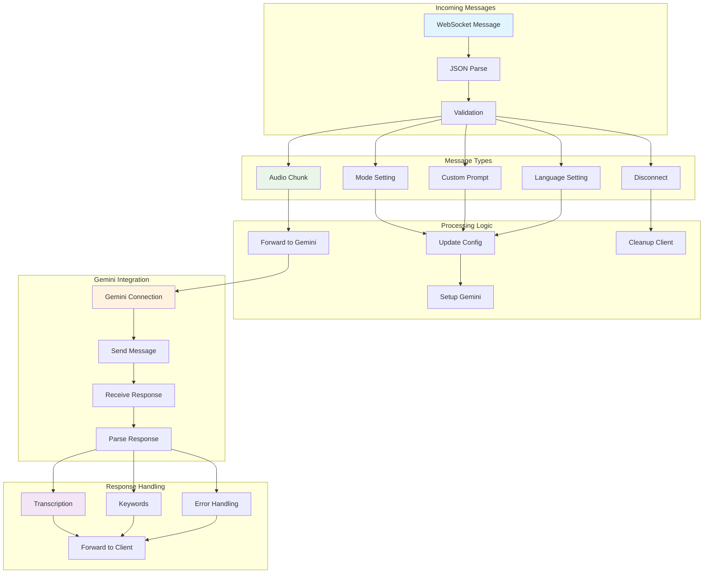
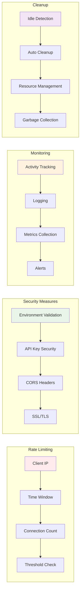
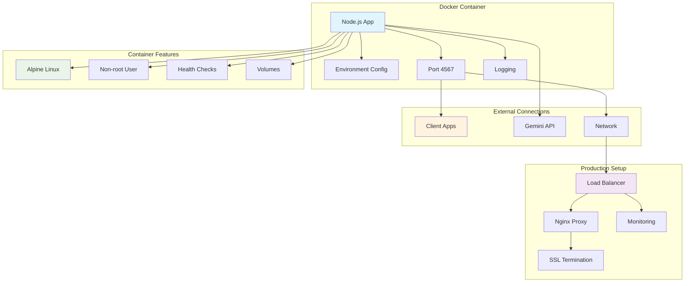

# Proxy Server Architecture Diagram

> [!IMPORTANT]
> This document is AI generated. Please verify the information before using it.

## Overall Architecture

## WebSocket Communication Flow

## Client Management System

## Message Processing Pipeline

## Rate Limiting & Security

## Docker Deployment Architecture

