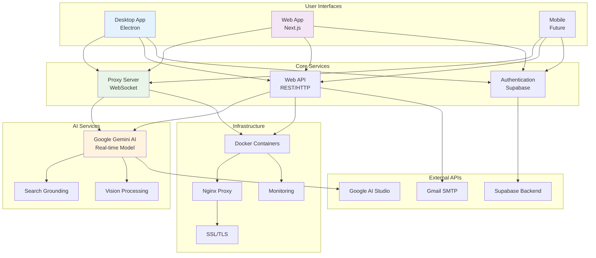
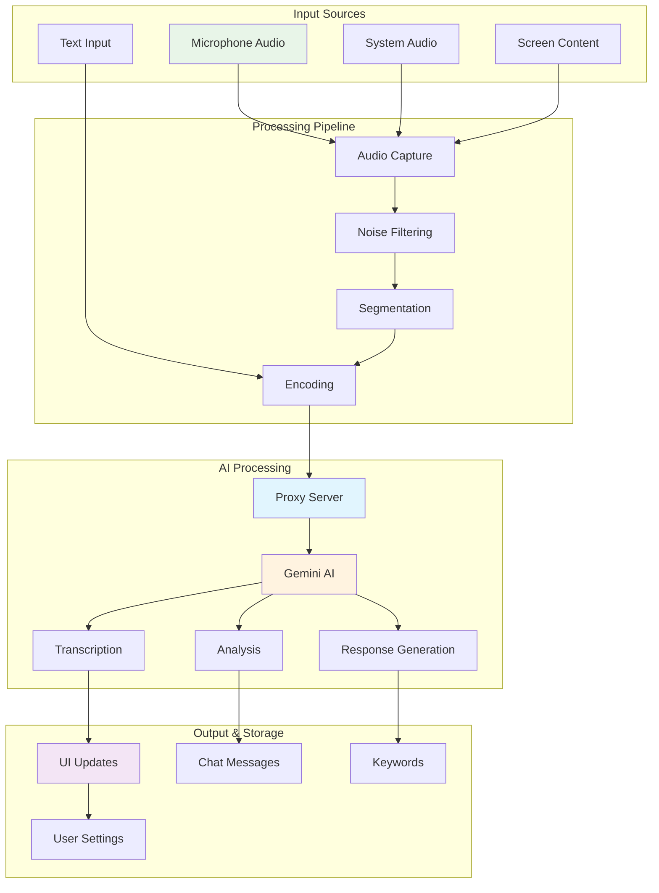
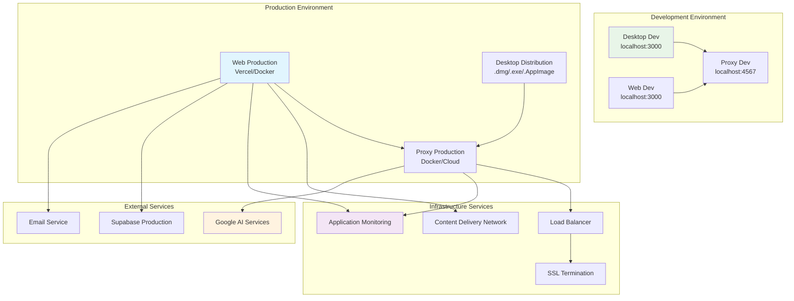
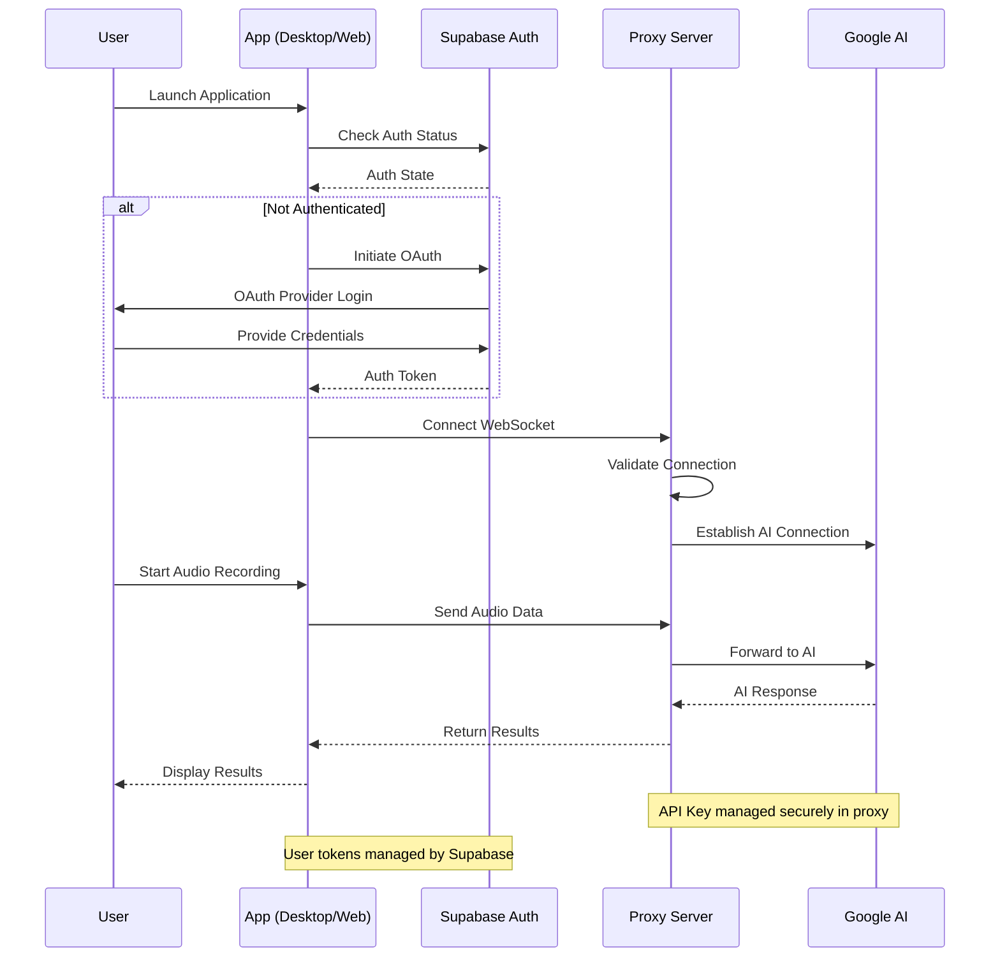
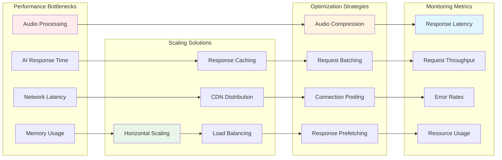

# System Integration Diagram

> [!IMPORTANT]
> This document is AI generated. Please verify the information before using it.

## Complete System Architecture

## Data Flow Diagram

## Deployment Architecture

## Security & Authentication Flow

## Performance & Scaling Considerations

