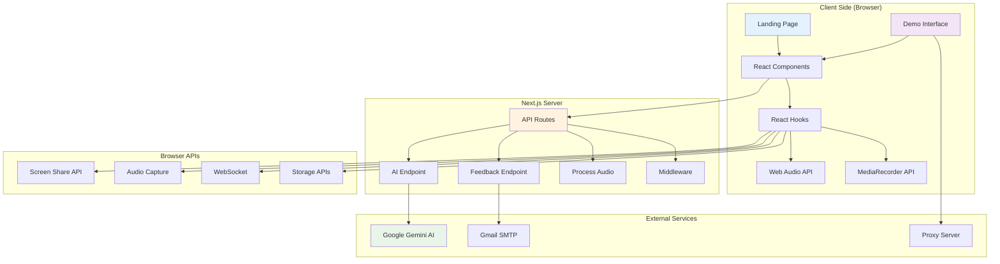
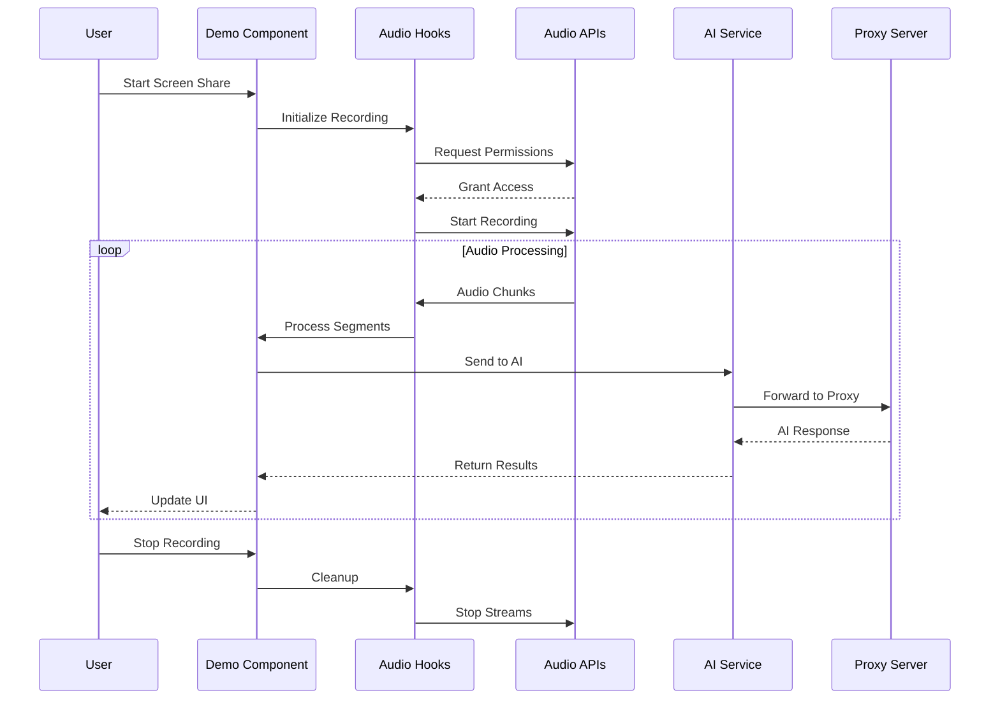
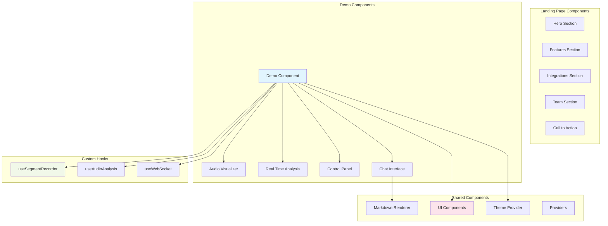
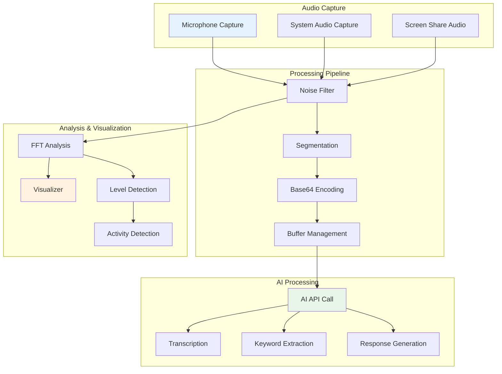

# Web Application Architecture Diagram

> [!IMPORTANT]
> This document is AI generated. Please verify the information before using it.

## Overall Architecture



## Demo Interface Flow



## Component Structure



## API Routes Architecture

```mermaid
graph LR
    subgraph "API Routes"
        AI[/api/ai]
        FB[/api/feedback]
        PA[/api/process-audio]
    end

    subgraph "AI Processing"
        GM[Gemini Model]
        TG[Text Generation]
        IG[Image Processing]
        SG[Search Grounding]
    end

    subgraph "Email Service"
        NM[Nodemailer]
        SMTP[Gmail SMTP]
        EM[Email Templates]
    end

    subgraph "Audio Processing"
        FF[FFmpeg]
        WA[Web Audio]
        AC[Audio Conversion]
    end

    AI --> GM
    GM --> TG
    GM --> IG
    GM --> SG

    FB --> NM
    NM --> SMTP
    NM --> EM

    PA --> FF
    PA --> WA
    PA --> AC

    style AI fill:#e8f5e8
    style FB fill:#fff3e0
    style PA fill:#f3e5f5
```

## Real-time Audio Processing Flow


