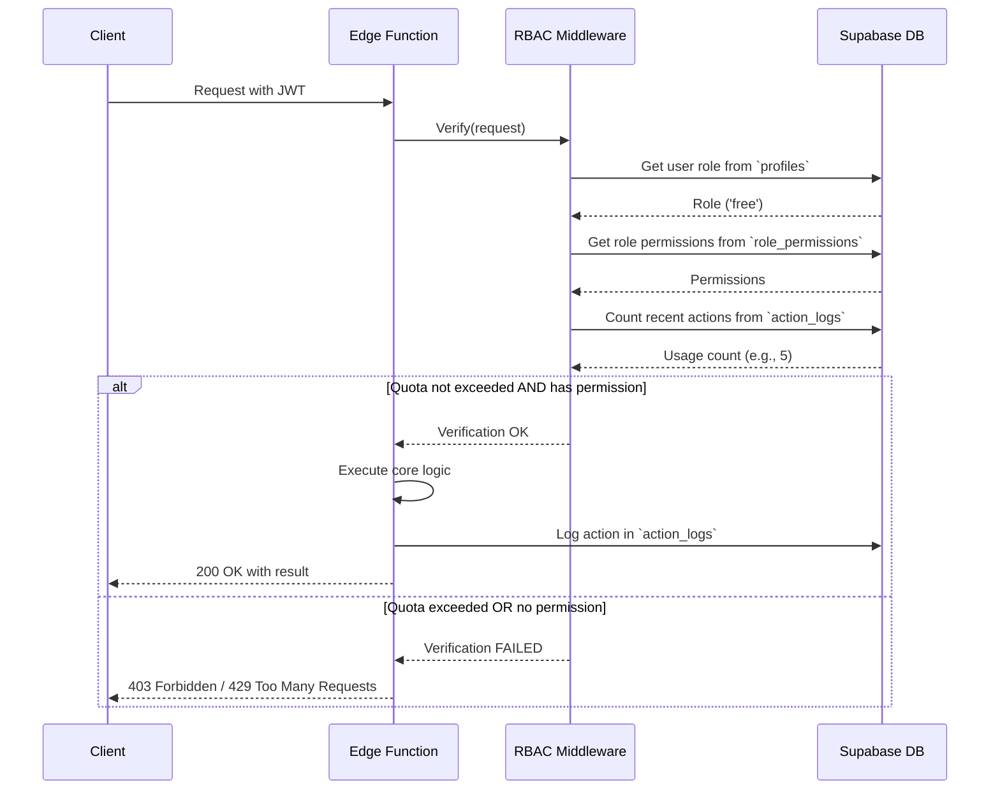

# Plan: Role-Based Access Control (RBAC) for Knovy

**Date**: 2025-09-13
**Author**: Gemini, Tech Lead Orchestrator

## 1. Overview

This document outlines the plan to implement a Role-Based Access Control (RBAC) and usage auditing system for the Knovy application. The goal is to move from an open-access model to a managed system where user capabilities are defined by their assigned roles.

## 2. Architecture & Design

The proposed architecture centers around Supabase, leveraging its database for storing roles/permissions and its Edge Functions for secure enforcement.

### 2.1. Data Models

We will introduce the following tables into the Supabase PostgreSQL database.

#### `profiles`
Links to `auth.users` and stores application-specific user data.

| Column | Type | Description |
| :--- | :--- | :--- |
| `id` | `uuid` | Primary Key. Foreign key to `auth.users.id`. |
| `role` | `text` | Foreign key to `roles.name`. E.g., 'free', 'pro', 'admin'. |
| `created_at` | `timestampz` | |
| `updated_at` | `timestampz` | |

#### `roles`
Defines the available roles in the system.

| Column | Type | Description |
| :--- | :--- | :--- |
| `name` | `text` | Primary Key. E.g., 'free', 'pro', 'admin', 'beta'. |
| `description`| `text` | A short description of the role. |

#### `permissions`
Defines granular permissions for specific actions.

| Column | Type | Description |
| :--- | :--- | :--- |
| `name` | `text` | Primary Key. E.g., 'ai_action:summarize', 'admin:read_users'. |
| `description`| `text` | A short description of the permission. |

#### `role_permissions`
A join table linking roles to their granted permissions.

| Column | Type | Description |
| :--- | :--- | :--- |
| `role_name` | `text` | Foreign key to `roles.name`. |
| `permission_name` | `text` | Foreign key to `permissions.name`. |

#### `action_logs`
Audits user actions to enforce quotas and for analytics.

| Column | Type | Description |
| :--- | :--- | :--- |
| `id` | `bigint` | Primary Key (auto-incrementing). |
| `user_id` | `uuid` | Foreign key to `auth.users.id`. |
| `action` | `text` | The action performed, matches a permission name. E.g., 'ai_action:summarize'. |
| `timestamp` | `timestampz` | Defaults to `now()`. |
| `metadata` | `jsonb` | Optional data, e.g., `{ "tokens_used": 1500 }`. |

### 2.2. RBAC Enforcement Flow

All secure Edge Functions will be protected by a new RBAC middleware.

### 2.3. Admin Dashboard
A new Next.js application will be created at `apps/admin-dashboard`. Access will be restricted by Supabase RLS to users with the `admin` role. It will provide UI for:
- Listing all users and their assigned roles.
- Changing a user's role.
- Viewing aggregated usage statistics.
- Viewing action logs for a specific user.

## 3. Task Breakdown & Assignments

| # | Task | Agent | Status |
| :- | :--- | :--- | :--- |
| 1 | Design the database schema for RBAC tables. | `@agents/universal/backend-developer` | **Done** |
| 2 | Create Supabase migration files for the new schema. | `@agents/universal/backend-developer` | **Done** |
| 3 | Develop a shared RBAC middleware for Edge Functions. | `@agents/universal/backend-developer` | **Done** |
| 4 | Integrate middleware and logging into AI Action functions. | `@agents/universal/backend-developer` | **Done** |
| 5 | Design API endpoints for the admin dashboard. | `@agents/universal/api-architect` | **Done** |
| 6 | Implement secure Edge Functions for the admin API. | `@agents/universal/backend-developer` | **Done** |
| 6.1| **(New)** Create `/me/permissions` endpoint for the client. | `@agents/universal/backend-developer` | **Done** |
| 7 | Update desktop app to fetch permissions and be role-aware. | `@agents/specialized/react-nextjs-expert` | To Do |
| 8 | Build the frontend for the admin dashboard app. | `@agents/specialized/react-nextjs-expert` | To Do |
| 9 | Document the new RBAC system. | `@agents/core/documentation-specialist` | To Do |

This plan provides a clear path forward. Let's begin with the database design.
