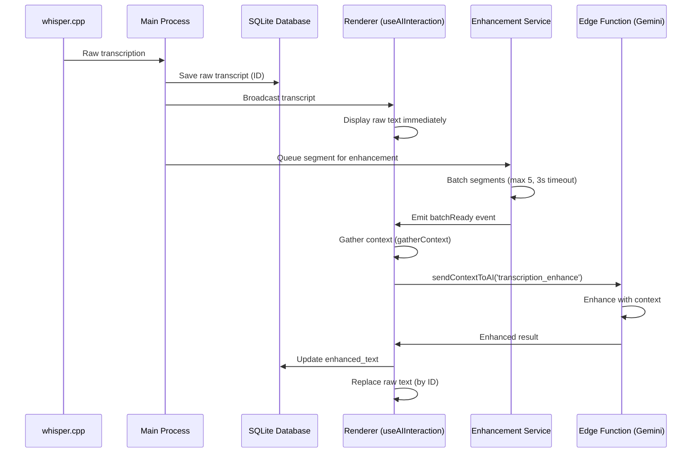

# Whisper.cpp Transcription Architecture Review & Improvement Plan

**Status:** 🔵 Planning
**Priority:** High
**Estimated Duration:** 10-12 days
**Created:** January 1, 2025
**Last Updated:** January 1, 2025

## Executive Summary

The whisper.cpp local transcription implementation is functional and provides excellent offline speech-to-text capabilities with progressive enhancement. However, the current architecture has diverged from the unified AI action pattern used throughout the application, creating code duplication and maintenance challenges.

### Key Findings

#### ✅ What Works Well
- **Local Transcription**: whisper.cpp provides fast, private, offline transcription
- **Two-Stage Detection**: Improved accuracy for Traditional Chinese users
- **Progressive Enhancement**: Raw text displays immediately, enhanced text updates asynchronously
- **Dual Audio Streams**: Separate microphone and system audio processing
- **ID-Based Updates**: Clean UI update mechanism without duplicates

#### ⚠️ Critical Issues
1. **Architecture Misalignment**: Enhancement bypasses unified AI action pattern
2. **Code Duplication**: Context gathering, session management duplicated
3. **Missing Retry Logic**: Other AI actions have retry, enhancement doesn't
4. **Incomplete Schema**: Supabase migration missing quota definitions
5. **Outdated Documentation**: Plans don't reflect current implementation

#### 📊 Impact Assessment
- **Maintainability**: Medium risk - duplicate code increases maintenance burden
- **Performance**: Low risk - current implementation performs well
- **Security**: Low risk - no security vulnerabilities identified
- **User Experience**: No impact - changes are architectural only

### Recommended Approach

**Integrate transcription enhancement into the unified AI action system** while preserving:
- Client-side batching for API efficiency
- ID-based UI updates for clean user experience
- Progressive enhancement pattern (raw → enhanced)
- All existing functionality

---

## Phase 1: Architecture Analysis & Documentation

**Duration:** 2-3 days
**Agents:** @code-reviewer.md, @docs-architect.md, @context-manager.md

### Objectives
- Map current enhancement flow end-to-end
- Document integration points with AI action system
- Identify all code duplication instances
- Create current vs. proposed architecture diagrams

### Tasks

#### 1.1 Current Flow Documentation
**Owner:** @docs-architect.md

- [ ] Document transcription flow: whisper.cpp → main process → renderer
- [ ] Map enhancement flow: segment creation → batching → Edge Function → UI update
- [ ] Identify all files involved in enhancement pipeline
- [ ] Create sequence diagrams for current implementation

**Deliverable:** `docs/architecture/transcription-flow-current.md`

#### 1.2 Code Duplication Analysis
**Owner:** @code-reviewer.md

Review these duplicate patterns:

**Context Gathering:**
- `useAIInteraction.ts::gatherContext()` (lines 141-161)
- `transcriptionEnhancementService.ts` session context building
- `whisperBackend.ts` context management (lines 631-692)

**Session Management:**
- `main/index.ts` session handlers (lines 161-222)
- Enhancement service session tracking
- Whisper backend session context maps

**Error Handling:**
- AI action error handling in `useAIInteraction.ts` (lines 389-398)
- Enhancement error events in `RealTimeAnalysis.tsx` (lines 95-107)
- Whisper backend error handling

**Deliverable:** `docs/review/code-duplication-report.md` with specific line references

#### 1.3 Integration Point Mapping
**Owner:** @context-manager.md

Map all integration points:

1. **IPC Communication:**
   - `main/index.ts` transcription:data handler (lines 801-965)
   - `main/index.ts` transcription:update handler (lines 967-980)
   - `preload/index.ts` enhancement methods (lines 56-59)

2. **Event Flow:**
   - Transcription → Main Process → Database → UI
   - Enhancement Request → Batching → Edge Function → Database → UI Update

3. **State Management:**
   - `useAIInteraction.ts` transcriptions state
   - `RealTimeAnalysis.tsx` enhancement state (lines 44-46)
   - Main process enhancement event listeners (lines 1429-1503)

**Deliverable:** Integration point map with data flow diagrams

#### 1.4 Plan vs. Implementation Comparison
**Owner:** @docs-architect.md

Compare these plan files against implementation:
- `plans/20250928-local-transcription.md`
- `plans/20250930-audio-processing.md`
- `plans/20250930-multilingual-whisper.md`

Document:
- Features implemented beyond plan
- Planned features not implemented
- Architectural deviations
- Outdated assumptions

**Deliverable:** `docs/review/plan-implementation-delta.md`

### Success Criteria
- [ ] Complete understanding of current enhancement architecture
- [ ] All code duplication instances identified
- [ ] Integration points fully mapped
- [ ] Discrepancies between plans and implementation documented

---

## Phase 2: Unified AI Action Integration

**Duration:** 3-4 days
**Agents:** @frontend-developer.md, @code-reviewer.md

### Objectives
- Integrate enhancement into `useAIInteraction.ts` unified pattern
- Preserve client-side batching for efficiency
- Reuse context gathering logic
- Apply consistent retry and error handling

### Tasks

#### 2.1 Update AI Action Type System
**Owner:** @frontend-developer.md

**File:** `apps/app/src/renderer/src/hooks/useAIInteraction.ts`

```typescript
// Current (line 13)
export type AIAction = 'chat' | 'answer' | 'summary' | 'keyword_search' | 'screenshot' | 'file'

// Proposed
export type AIAction = 'chat' | 'answer' | 'summary' | 'keyword_search' | 'screenshot' | 'file' | 'transcription_enhance'
```

Add enhancement action case in `sendContextToAI` (after line 314):

```typescript
case 'transcription_enhance': {
  functionName = 'transcription-enhance'

  // Reuse existing context gathering
  const sessionId = await (window as any).electronAPI.invoke('session:get-id')
  const existingSummary = await (window as any).electronAPI.invoke('db:get-summary', sessionId)
  const context = await gatherContext()

  functionPayload.segments = query // segments to enhance (batch)
  functionPayload.sessionContext = {
    sessionId,
    conversationHistory: context?.text ? [context.text] : [],
    userLanguage: currentLanguage
  }
  functionPayload.existing_summary = existingSummary?.content
  functionPayload.recent_transcriptions = context?.text
  break
}
```

**Changes:**
- [ ] Add `transcription_enhance` to `AIAction` type
- [ ] Implement enhancement case in `sendContextToAI`
- [ ] Reuse `gatherContext()` for context
- [ ] Add usage logging (lines 332-356 pattern)
- [ ] Apply consistent error handling

#### 2.2 Preserve Batching Service
**Owner:** @frontend-developer.md

**Decision:** Keep `TranscriptionEnhancementService` for client-side batching but integrate with AI action pattern.

**File:** `apps/app/src/main/transcriptionEnhancementService.ts`

Refactor to emit events instead of calling Edge Function directly:

```typescript
private async processBatch(sessionId: string): Promise<void> {
  // ... existing batching logic ...

  // BEFORE: Direct Edge Function call
  // const response = await this.callEnhancementAPI(enhanceRequest)

  // AFTER: Emit event for unified AI action handler
  this.emit('batchReady', {
    sessionId,
    segments: batchSegments,
    sessionContext
  })
}
```

Remove direct API call method:
- [ ] Remove `callEnhancementAPI()` method (lines 247-273)
- [ ] Change `processBatch()` to emit events instead of calling API
- [ ] Let main process forward to unified AI action handler

#### 2.3 Update Main Process Handler
**Owner:** @frontend-developer.md

**File:** `apps/app/src/main/index.ts`

Modify transcription:data handler (lines 801-965):

```typescript
// BEFORE: Direct enhancement service call (lines 922-950)
const transcriptionService = getWhisperBackend()
const enhancementService = transcriptionService.getEnhancementService()
if (enhancementService) {
  setTimeout(() => {
    enhancementService.enhanceSegment(segment, sessionContext, false)
  }, 100)
}

// AFTER: Use unified AI action via IPC to renderer
event.sender.send('ai:trigger-enhancement', {
  transcriptId,
  segment: cleanContent,
  sessionContext
})
```

Changes:
- [ ] Remove direct enhancement service calls
- [ ] Send event to renderer for unified AI action handling
- [ ] Let renderer manage enhancement via `useAIInteraction`
- [ ] Simplify event setup (lines 1429-1503)

#### 2.4 Update RealTimeAnalysis Component
**Owner:** @frontend-developer.md

**File:** `apps/app/src/renderer/src/components/RealTimeAnalysis.tsx`

Simplify enhancement handlers:

```typescript
// BEFORE: Direct enhancement service events (lines 49-107)
const handleSegmentEnhanced = (data: SegmentEnhancedEvent) => { ... }
const handleEnhancementError = (error: EnhancementErrorEvent) => { ... }
const { isEnhancementReady } = useTranscriptionEnhancement({ ... })

// AFTER: Use unified AI action from useAIInteraction
const { sendContextToAI } = useAIInteraction()

// Listen for enhancement triggers from main process
useEffect(() => {
  const unsubscribe = (window as any).electronAPI?.on('ai:trigger-enhancement',
    ({ transcriptId, segment, sessionContext }) => {
      sendContextToAI('transcription_enhance', segment, /* context */)
    }
  )
  return unsubscribe
}, [sendContextToAI])
```

Changes:
- [ ] Remove `useTranscriptionEnhancement` hook
- [ ] Use `useAIInteraction` for enhancement
- [ ] Listen for enhancement triggers from main process
- [ ] Handle enhancement via unified AI action

#### 2.5 Merge useTranscriptionEnhancement into useAIInteraction
**Owner:** @frontend-developer.md

**Files to Modify:**
1. `apps/app/src/renderer/src/hooks/useAIInteraction.ts`
2. `apps/app/src/renderer/src/hooks/useTranscriptionEnhancement.ts` (DELETE after migration)

Migrate enhancement setup logic:

```typescript
// Add to useAIInteraction.ts initialization
useEffect(() => {
  const setupEnhancement = async () => {
    if (!session?.access_token || !sessionProfile) return

    const supabaseUrl = import.meta.env.VITE_SUPABASE_URL
    const supabaseAnonKey = import.meta.env.VITE_SUPABASE_ANON_KEY

    await window.electronAPI.transcriptionSetupEnhancement(
      supabaseUrl, supabaseAnonKey, session.access_token
    )
  }

  setupEnhancement()
}, [session, sessionProfile])
```

Changes:
- [ ] Move enhancement initialization to `useAIInteraction`
- [ ] Delete `useTranscriptionEnhancement.ts` file
- [ ] Update imports in `RealTimeAnalysis.tsx`

### Success Criteria
- [ ] Enhancement integrated into unified AI action pattern
- [ ] No code duplication for context gathering
- [ ] Client-side batching preserved
- [ ] Consistent error handling across all AI actions
- [ ] All existing functionality preserved

---

## Phase 3: Retry Logic & Error Handling

**Duration:** 2 days
**Agents:** @backend-architect.md, @code-reviewer.md

### Objectives
- Apply `gemini-client.ts` retry logic to enhancement
- Ensure consistent error handling
- Improve resilience for intermittent failures

### Tasks

#### 3.1 Review Gemini Client Retry Logic
**Owner:** @code-reviewer.md

**File:** `supabase/functions/_shared/gemini-client.ts`

Document retry strategy:
- Retry attempts and backoff
- Error types that trigger retry
- Timeout handling
- Circuit breaker pattern (if any)

**Deliverable:** Document retry logic for reuse

#### 3.2 Apply Retry to Enhancement Edge Function
**Owner:** @backend-architect.md

**File:** `supabase/functions/transcription-enhance/index.ts`

Currently missing retry logic. Apply pattern from other Edge Functions:

```typescript
import { createGeminiClient } from '../_shared/gemini-client.ts'

// Use shared client with retry logic
const gemini = createGeminiClient(apiKey)
const response = await gemini.generateContentWithRetry(/* params */)
```

Changes:
- [ ] Import and use shared `gemini-client.ts`
- [ ] Apply retry logic to all API calls
- [ ] Add timeout handling
- [ ] Consistent error messages

#### 3.3 Update Error Handling in useAIInteraction
**Owner:** @frontend-developer.md

**File:** `apps/app/src/renderer/src/hooks/useAIInteraction.ts`

Ensure enhancement errors handled consistently:

```typescript
case 'transcription_enhance': {
  // ... enhancement logic ...
}

// Existing error handling (lines 389-398) already covers all actions
catch (e: unknown) {
  console.error('[AIInteraction] Error in sendContextToAI:', e)
  setAiMessages((prev) => [
    ...prev,
    {
      id: `err-ai-${Date.now()}`,
      role: 'assistant',
      content: `[AI 錯誤] 無法處理您的請求: ${e instanceof Error ? e.message : String(e)}`
    }
  ])
}
```

Changes:
- [ ] Verify enhancement errors caught by existing handler
- [ ] Add specific error messages for enhancement failures
- [ ] Log enhancement errors for debugging

### Success Criteria
- [ ] Retry logic applied to enhancement Edge Function
- [ ] Consistent error handling across all AI actions
- [ ] Improved resilience for transient failures
- [ ] Clear error messages for users

---

## Phase 4: Database & Schema Alignment

**Duration:** 1-2 days
**Agents:** @database-admin.md, @security-auditor.md

### Objectives
- Complete Supabase migration for entitlements
- Clarify quota strategy
- Document free tier access policy
- Validate SQLite schema

### Tasks

#### 4.1 Review Supabase Migration
**Owner:** @database-admin.md

**File:** `supabase/migrations/20250930200000_add_transcription_enhance_entitlement.sql`

Current migration only updates entitlements config:

```sql
UPDATE public.entitlements
SET config = config || '{"allow_ai_action:transcription_enhance": true}'
WHERE role IN ('pro', 'beta', 'admin', 'free');
```

**Issues:**
- No quota definition for `daily_ai_action:transcription_enhance_calls`
- Free tier access enabled but not documented
- No daily limits specified

**Proposed:**

```sql
-- Add entitlement to all roles
UPDATE public.entitlements
SET config = config || '{"allow_ai_action:transcription_enhance": true}'
WHERE role IN ('pro', 'beta', 'admin', 'free');

-- Add comment documenting quota strategy
COMMENT ON COLUMN public.entitlements.config IS
'Transcription enhancement is available to all users but implicitly controlled by session time limits.
Free tier: limited by max_session_duration
Pro/Beta/Admin: limited by max_session_duration
No separate API call quota needed as enhancement is triggered by transcription volume.';

-- Optionally add quotas table entry for documentation
INSERT INTO public.quotas (role, quota_type, limit_value, description)
VALUES
  ('free', 'session_time_controls_enhancement', NULL,
   'Transcription enhancement implicitly limited by max_session_duration'),
  ('pro', 'session_time_controls_enhancement', NULL,
   'Transcription enhancement implicitly limited by max_session_duration');
```

**Decision Needed:**
- Should we add explicit daily API call limits for enhancement?
- Or rely on session time limits to control enhancement usage?

**Recommendation:** Rely on session time limits. Rationale:
- Enhancement is passive (triggered by transcription)
- Session time already controls transcription volume
- Simpler quota management
- Consistent with current implementation

Changes:
- [ ] Document quota strategy in migration
- [ ] Add comments explaining free tier access
- [ ] Consider adding quotas table entries for documentation
- [ ] Validate against actual usage patterns

#### 4.2 Validate SQLite Schema
**Owner:** @database-admin.md

**File:** `apps/app/src/main/database.ts`

Review enhancement columns (lines 45-67):

```sql
CREATE TABLE transcripts (
  -- ... existing columns ...
  raw_text TEXT,                      -- Original whisper output
  enhanced_text TEXT,                 -- Gemini-enhanced version
  detected_language TEXT,             -- From two-stage detection
  whisper_language TEXT,              -- Language used for Stage 2
  user_language TEXT,                 -- User's preferred language
  used_two_stage_detection INTEGER DEFAULT 0,
  enhancement_status TEXT DEFAULT "pending",
  enhancement_metadata TEXT,          -- JSON: keywords, intention, confidence
  processing_time_ms INTEGER,
  enhancement_updated_at TEXT
);
```

**Validate:**
- [ ] All columns used in `databaseService.ts`
- [ ] No unused columns
- [ ] Indexes for common queries
- [ ] Data types appropriate

**Potential Optimization:**
```sql
-- Add index for enhancement status queries
CREATE INDEX IF NOT EXISTS idx_transcripts_enhancement_status
ON transcripts(enhancement_status, session_id);

-- Add index for timestamp queries
CREATE INDEX IF NOT EXISTS idx_transcripts_timestamp
ON transcripts(session_id, timestamp);
```

#### 4.3 Security Review
**Owner:** @security-auditor.md

Review enhancement access control:

**Authentication:**
- [ ] User token validation in Edge Function
- [ ] Session validation before enhancement
- [ ] Rate limiting considerations

**Authorization:**
- [ ] Entitlement check in Edge Function
- [ ] Free tier access properly gated
- [ ] No privilege escalation risks

**Data Security:**
- [ ] Enhanced text stored securely in SQLite
- [ ] No PII leakage in logs
- [ ] Proper error messages (no sensitive data)

**Edge Function Security:**
```typescript
// Verify user has enhancement entitlement
const { data: profile } = await supabase
  .from('profiles')
  .select('role, entitlements')
  .eq('id', user.id)
  .single()

if (!profile?.entitlements?.allow_ai_action?.transcription_enhance) {
  throw new Error('Transcription enhancement not enabled for user')
}
```

Changes:
- [ ] Add entitlement check in Edge Function
- [ ] Validate session ownership
- [ ] Add rate limiting headers
- [ ] Sanitize error messages

### Success Criteria
- [ ] Supabase migration complete with quota documentation
- [ ] SQLite schema validated and optimized
- [ ] Security review complete with no critical findings
- [ ] Free tier access policy clearly documented

---

## Phase 5: Code Cleanup & Optimization

**Duration:** 2 days
**Agents:** @code-reviewer.md, @frontend-developer.md

### Objectives
- Remove redundant code
- Clean up outdated comments
- Simplify enhancement architecture
- Optimize performance where possible

### Tasks

#### 5.1 Remove Redundant Code
**Owner:** @code-reviewer.md

**Files to Clean:**

1. **apps/app/src/main/whisperBackend.ts**
   - [ ] Remove context management (lines 631-692) - now in useAIInteraction
   - [ ] Remove `setupEnhancementService()` method (lines 109-121)
   - [ ] Remove `getEnhancementService()` method (lines 134-137)
   - [ ] Remove enhancement trigger (lines 308-316)
   - [ ] Clean up imports related to enhancement service

2. **apps/app/src/main/index.ts**
   - [ ] Simplify enhancement event setup (lines 1429-1503)
   - [ ] Remove duplicate context gathering
   - [ ] Clean up enhancement event cleanup (lines 46-47)

3. **apps/app/src/renderer/src/components/RealTimeAnalysis.tsx**
   - [ ] Remove direct enhancement event handlers (lines 49-107)
   - [ ] Remove enhancement state management (lines 44-46)
   - [ ] Simplify to use unified AI action

4. **apps/app/src/renderer/src/hooks/useTranscriptionEnhancement.ts**
   - [ ] DELETE entire file (merged into useAIInteraction)

#### 5.2 Update Comments & Documentation
**Owner:** @code-reviewer.md

Remove outdated comments referencing:
- Network transcription (fully local now)
- Gemini Live API (replaced by whisper.cpp)
- Old enhancement flow

Update comments to reflect:
- Unified AI action pattern
- Client-side batching strategy
- Progressive enhancement approach

**Files with outdated comments:**
- `apps/app/src/renderer/src/services/transcription.ts`
- `apps/app/src/main/whisperBackend.ts`
- `apps/app/src/renderer/src/components/RealTimeAnalysis.tsx`

#### 5.3 Simplify Enhancement Service
**Owner:** @frontend-developer.md

**File:** `apps/app/src/main/transcriptionEnhancementService.ts`

Simplify to focus on batching only:

```typescript
// Remove direct API call capability
// Keep only batching and event emission
export class TranscriptionEnhancementService extends EventEmitter {
  // ... batching logic ...

  private async processBatch(sessionId: string): Promise<void> {
    // Emit event instead of calling API
    this.emit('batchReady', {
      sessionId,
      segments: batchSegments,
      sessionContext
    })
  }

  // Remove callEnhancementAPI method
}
```

Changes:
- [ ] Remove API call method
- [ ] Focus on batching only
- [ ] Emit events for unified handler
- [ ] Update class documentation

#### 5.4 Performance Optimization
**Owner:** @code-reviewer.md

Review and optimize:

**Database Queries:**
- [ ] Add indexes for common queries (Phase 4.2)
- [ ] Batch database updates where possible
- [ ] Optimize transcript retrieval

**Event Handling:**
- [ ] Reduce event listener count
- [ ] Debounce rapid updates
- [ ] Optimize IPC message size

**Memory Management:**
- [ ] Review enhancement service cleanup
- [ ] Clear old context maps in whisper backend
- [ ] Optimize transcript storage

#### 5.5 TypeScript Type Cleanup
**Owner:** @frontend-developer.md

Ensure consistent types across codebase:

**Interface Consolidation:**
```typescript
// Consolidate in types file
export interface EnhancementRequest {
  transcriptId: string
  segment: string
  sessionContext: SessionContext
}

export interface EnhancementResponse {
  transcriptId: string
  enhancedText: string
  keywords: string[]
  intention: Intention
  confidence: number
}
```

Changes:
- [ ] Consolidate enhancement types
- [ ] Remove duplicate interface definitions
- [ ] Update imports across files
- [ ] Add JSDoc comments

### Success Criteria
- [ ] All redundant code removed
- [ ] Comments updated to reflect current implementation
- [ ] Enhancement service simplified
- [ ] Performance optimized
- [ ] TypeScript types consistent

---

## Phase 6: Testing & Validation

**Duration:** 2 days
**Agents:** @code-reviewer.md, @test-automator.md

### Objectives
- Verify enhancement works after refactoring
- Test error handling and retry logic
- Validate quota enforcement
- Ensure no regressions

### Tasks

#### 6.1 Manual Testing Checklist
**Owner:** @code-reviewer.md

**Enhancement Flow:**
- [ ] Start transcription session
- [ ] Verify raw text appears immediately
- [ ] Verify enhanced text replaces raw text (2-5 seconds)
- [ ] Check Traditional Chinese conversion (zh-TW users)
- [ ] Verify keyword extraction and highlighting
- [ ] Test both microphone and system audio

**Error Handling:**
- [ ] Test network disconnection during enhancement
- [ ] Test API rate limiting
- [ ] Test invalid authentication token
- [ ] Test quota exhaustion
- [ ] Verify error messages displayed to user

**Batching:**
- [ ] Verify segments batched correctly (max 5)
- [ ] Test timeout batching (3 seconds)
- [ ] Test urgent segment processing
- [ ] Verify no duplicate enhancements

**Context Integration:**
- [ ] Verify existing summary used in enhancement
- [ ] Test recent transcriptions context
- [ ] Verify conversation history integration

#### 6.2 Integration Testing
**Owner:** @test-automator.md

Create automated tests:

```typescript
// Test enhancement integration
describe('Transcription Enhancement Integration', () => {
  it('should enhance transcription via unified AI action', async () => {
    // Setup
    const mockTranscript = { id: 'test-1', content: 'test raw text' }

    // Trigger enhancement
    await sendContextToAI('transcription_enhance', mockTranscript)

    // Verify Edge Function called with correct context
    expect(mockSupabase.functions.invoke).toHaveBeenCalledWith(
      'transcription-enhance',
      expect.objectContaining({
        body: expect.objectContaining({
          existing_summary: expect.any(String),
          recent_transcriptions: expect.any(String)
        })
      })
    )
  })

  it('should handle enhancement errors gracefully', async () => {
    // Setup error condition
    mockSupabase.functions.invoke.mockRejectedValue(new Error('API Error'))

    // Trigger enhancement
    await sendContextToAI('transcription_enhance', mockTranscript)

    // Verify error handled
    expect(console.error).toHaveBeenCalled()
    expect(aiMessages).toContainEqual(
      expect.objectContaining({ content: expect.stringContaining('錯誤') })
    )
  })
})
```

Tests to create:
- [ ] Enhancement via unified AI action
- [ ] Context gathering reuse
- [ ] Error handling integration
- [ ] Batching behavior
- [ ] Database updates
- [ ] UI update mechanism

#### 6.3 Performance Testing
**Owner:** @code-reviewer.md

Measure performance impact:

**Before Refactoring:**
- Enhancement trigger latency: ?ms
- API call frequency: ? calls/minute
- Memory usage: ?MB
- Event listener count: ?

**After Refactoring:**
- Enhancement trigger latency: ?ms (target: no regression)
- API call frequency: ? calls/minute (target: same or lower)
- Memory usage: ?MB (target: lower due to cleanup)
- Event listener count: ? (target: lower due to consolidation)

Benchmark:
- [ ] Enhancement latency
- [ ] API call frequency
- [ ] Memory usage
- [ ] Event processing time

#### 6.4 Regression Testing
**Owner:** @code-reviewer.md

Verify no regressions in:

**Core Functionality:**
- [ ] Local transcription still works
- [ ] Two-stage language detection
- [ ] Dual audio stream processing
- [ ] Keyword extraction
- [ ] UI threading (left/right)

**Other AI Actions:**
- [ ] Chat still works
- [ ] Answer recommendation works
- [ ] Summary generation works
- [ ] Keyword search works
- [ ] Screenshot analysis works

**Database:**
- [ ] Transcripts saved correctly
- [ ] Enhancement metadata stored
- [ ] Session management intact
- [ ] Summary persistence works

### Success Criteria
- [ ] All manual tests pass
- [ ] Integration tests created and passing
- [ ] No performance regressions
- [ ] No functional regressions
- [ ] Error handling verified

---

## Phase 7: Documentation Update

**Duration:** 1 day
**Agents:** @docs-architect.md

### Objectives
- Update plan files to match implementation
- Update architecture documentation
- Add enhancement flow diagrams
- Document API changes

### Tasks

#### 7.1 Update Plan Files
**Owner:** @docs-architect.md

**Files to Update:**
1. `plans/20250928-local-transcription.md`
2. `plans/20250930-audio-processing.md`
3. `plans/20250930-multilingual-whisper.md`

Add section to each plan:

```markdown
## Implementation Status (Updated: January 2025)

### Architecture Changes
- Transcription enhancement integrated into unified AI action pattern
- Client-side batching preserved for API efficiency
- Context gathering consolidated in useAIInteraction
- Retry logic applied from gemini-client.ts

### Completed Features
- ✅ Local transcription with whisper.cpp
- ✅ Two-stage language detection
- ✅ Progressive enhancement with Gemini API
- ✅ Unified AI action integration
- ✅ Consistent error handling and retry logic

### Deviations from Original Plan
- Enhancement now uses unified AI action pattern (improved maintainability)
- Batching implemented client-side (improved efficiency)
- No separate quota for enhancement (controlled by session time)
```

#### 7.2 Update Architecture Documentation
**Owner:** @docs-architect.md

**File:** `docs/architecture/overview.md`

Update transcription enhancement section (lines 111-168):

```markdown
### Transcription Enhancement Architecture

The desktop application implements progressive enhancement integrated with the unified AI action system.

#### Enhancement Flow



#### Key Features

1. **Unified AI Action Integration**: Enhancement uses the same pattern as chat, answer, summary
2. **Client-Side Batching**: Reduces API calls while maintaining responsiveness
3. **Context Reuse**: Leverages existing `gatherContext()` for summary and history
4. **Progressive Display**: Raw text shown immediately, enhanced text updates asynchronously
5. **ID-Based Updates**: Clean UI updates without duplicates
```

#### 7.3 Create Enhancement Integration Guide
**Owner:** @docs-architect.md

**New File:** `docs/guides/transcription-enhancement-integration.md`

Document:
- How enhancement integrates with AI actions
- Batching strategy and configuration
- Context gathering mechanism
- Error handling and retry logic
- Testing approach

#### 7.4 Update API Documentation
**Owner:** @docs-architect.md

**File:** `docs/api/edge-functions.md`

Update transcription-enhance documentation:

```markdown
### transcription-enhance

**Path:** `/functions/v1/transcription-enhance`
**Method:** POST
**Authentication:** Required (Bearer token)

#### Request Body

```typescript
{
  segments: TranscriptionSegment[],
  sessionContext: {
    sessionId: string
    conversationHistory: string[]
    userLanguage: string
  },
  existing_summary?: string,
  recent_transcriptions?: string,
  language: string
}
```

#### Response

```typescript
{
  segments: EnhancedSegment[],
  processingTime: number,
  errors?: Array<{ segmentId: string, error: string }>
}
```

#### Context Integration

This endpoint uses the same context gathering as other AI actions:
- `existing_summary`: Current session summary
- `recent_transcriptions`: Recent conversation context
- Reuses unified error handling and retry logic
```

#### 7.5 Update README Files
**Owner:** @docs-architect.md

Update project README to reflect:
- Unified AI action architecture
- Enhancement integration
- Simplified codebase structure

### Success Criteria
- [ ] All plan files updated
- [ ] Architecture documentation reflects current state
- [ ] Enhancement integration guide created
- [ ] API documentation updated
- [ ] README files updated

---

## Implementation Timeline

### Week 1
- **Days 1-2:** Phase 1 - Architecture Analysis
- **Days 3-5:** Phase 2 - Unified AI Action Integration (Part 1)

### Week 2
- **Days 1-2:** Phase 2 - Unified AI Action Integration (Part 2)
- **Days 3-4:** Phase 3 - Retry Logic & Error Handling
- **Day 5:** Phase 4 - Database & Schema Alignment

### Week 3
- **Days 1-2:** Phase 5 - Code Cleanup & Optimization
- **Days 3-4:** Phase 6 - Testing & Validation
- **Day 5:** Phase 7 - Documentation Update

**Total Duration:** 12 working days (2.5 weeks)

---

## Risk Assessment & Mitigation

### High Risk

#### Risk: Breaking Existing Enhancement Functionality
**Impact:** High - Users lose enhancement feature
**Probability:** Medium
**Mitigation:**
- Comprehensive testing before deployment
- Feature flag for gradual rollout
- Keep backup of old implementation
- Rollback plan ready

#### Risk: Performance Regression
**Impact:** Medium - Slower enhancement response
**Probability:** Low
**Mitigation:**
- Performance benchmarking before/after
- Load testing with concurrent users
- Preserve client-side batching
- Monitor production metrics

### Medium Risk

#### Risk: Context Gathering Changes Break Other AI Actions
**Impact:** High - Multiple features affected
**Probability:** Low
**Mitigation:**
- Extensive regression testing
- Test all AI actions after changes
- Code review by multiple agents
- Gradual integration approach

#### Risk: Database Migration Issues
**Impact:** Medium - Schema inconsistencies
**Probability:** Low
**Mitigation:**
- Test migration on staging first
- Backup database before migration
- Rollback script prepared
- Validate data integrity post-migration

### Low Risk

#### Risk: Documentation Becomes Outdated
**Impact:** Low - Developer confusion
**Probability:** Medium
**Mitigation:**
- Update docs as part of each phase
- Review docs before completion
- Link docs to code comments
- Set up doc review process

---

## Success Metrics

### Code Quality
- [ ] **Code Duplication:** Reduced by >50%
- [ ] **Cyclomatic Complexity:** No increase
- [ ] **Test Coverage:** Maintained or improved
- [ ] **TypeScript Errors:** None
- [ ] **Linting Warnings:** None

### Performance
- [ ] **Enhancement Latency:** No regression (target: <3s average)
- [ ] **API Call Frequency:** Same or lower
- [ ] **Memory Usage:** Reduced by >10%
- [ ] **Event Processing:** <100ms per event

### Functionality
- [ ] **Enhancement Accuracy:** Maintained (user feedback)
- [ ] **Error Rate:** No increase
- [ ] **Retry Success Rate:** >90%
- [ ] **UI Responsiveness:** No degradation

### Maintainability
- [ ] **Lines of Code:** Reduced by >20%
- [ ] **File Count:** Reduced (delete useTranscriptionEnhancement.ts)
- [ ] **Coupling:** Reduced (unified pattern)
- [ ] **Documentation:** Complete and current

---

## Rollback Plan

### If Critical Issues Discovered

**Phase 2-3 (AI Action Integration):**
1. Revert changes to `useAIInteraction.ts`
2. Restore `useTranscriptionEnhancement.ts`
3. Restore direct enhancement service calls in `main/index.ts`
4. Keep database changes (backward compatible)

**Phase 4 (Database Changes):**
1. Rollback Supabase migration
2. Restore previous entitlements configuration
3. Test with old schema

**Phase 5 (Code Cleanup):**
1. Restore deleted files from git history
2. Revert comment changes
3. Restore redundant code if needed

**Critical Failure (Complete Rollback):**
```bash
# Revert to pre-refactoring state
git revert <refactoring-commit-range>
git push origin main

# Redeploy previous version
pnpm --filter app build
```

---

## Post-Implementation Review

### Review Checklist
- [ ] All success metrics achieved
- [ ] No critical bugs in production
- [ ] User feedback positive
- [ ] Documentation complete
- [ ] Team knowledge transfer complete

### Lessons Learned
(To be filled after implementation)

### Future Improvements
(To be identified during implementation)

---

## Agent Assignment Summary

| Phase | Primary Agent | Supporting Agents | Duration |
|-------|---------------|-------------------|----------|
| Phase 1 | @docs-architect.md | @code-reviewer.md, @context-manager.md | 2-3 days |
| Phase 2 | @frontend-developer.md | @code-reviewer.md | 3-4 days |
| Phase 3 | @backend-architect.md | @code-reviewer.md | 2 days |
| Phase 4 | @database-admin.md | @security-auditor.md | 1-2 days |
| Phase 5 | @code-reviewer.md | @frontend-developer.md | 2 days |
| Phase 6 | @code-reviewer.md | @test-automator.md | 2 days |
| Phase 7 | @docs-architect.md | - | 1 day |

---

## Approval & Sign-off

- [ ] **Technical Lead:** Architecture approved
- [ ] **Product Owner:** Feature scope approved
- [ ] **Security Lead:** Security review passed
- [ ] **QA Lead:** Test plan approved
- [ ] **DevOps Lead:** Deployment plan approved

---

**Next Steps:**
1. Review and approve this plan
2. Assign agents to Phase 1 tasks
3. Begin architecture analysis
4. Schedule daily check-ins for progress tracking

**Questions? Concerns?**
Please review and provide feedback before beginning Phase 1.
