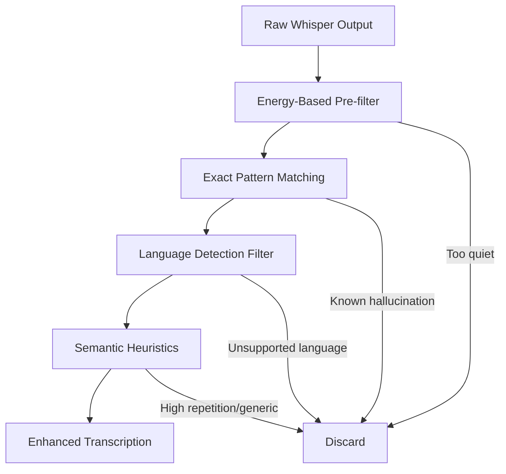

# Plan: Fix Whisper Hallucination Issue

**Status**: 🔵 In Progress
**Created**: 2025-10-09
**Owner**: Claude Code
**Agents**: @orchestrator, @workflow-coordinator, @ui-ux-designer, @code-reviewer

---

## Executive Summary

### Problem Statement
The Whisper model generates hallucinations when users are not talking, producing sentences from noise that are:
- In unsupported languages (Korean, French, etc. when we only support English and Traditional Chinese)
- Generic phrases unrelated to conversation context
- Repetitive patterns that indicate non-speech audio processing

### Known Hallucination Examples
```
- "请不吝点赞 订阅 转发 打赏支持明镜与点点栏目" (Simplified Chinese - video promotion)
- "Clear conversation with proper punctuation and grammar." (Generic phrase)
- "Client conversation with proper punctuation and grammar." (Generic phrase)
- "Merci d'avoir regardé la vidéo." (French)
- "Thank you." / "Thank you for watching." (Generic closings)
- "Click on the link in the description to watch the full video."
- "잘해. 잘해. 잘해." / "감사합니다. 감사합니다." (Korean - repetitive)
- "MBC 뉴스 이준범입니다." / "날씨였습니다." (Korean - news phrases)
```

### Goals
1. ✅ Filter known hallucination patterns without affecting legitimate transcriptions
2. ✅ Maintain low complexity - no ML models or complex heuristics
3. ✅ Support both English and Traditional Chinese while filtering other languages
4. ✅ Preserve user experience - no false positives on real speech
5. ✅ Make the system extensible for future hallucination patterns

---

## Architecture Analysis

### Current Filtering Implementation

**Location**: `apps/app/src/main/whisperBackend.ts:1292-1365`

**Existing Filters**:
1. ✅ Single/few CJK characters (1-3 chars)
2. ✅ Parenthetical/bracket expressions
3. ✅ Generic English phrases ("Thanks for watching", "Thank you", etc.)
4. ✅ Very short nonsensical text (≤2 chars)
5. ✅ Only punctuation
6. ✅ Repeated character patterns
7. ✅ Mostly non-Latin text for English transcriptions (70% threshold)
8. ✅ Repetitive content (word repetition ratio > 3)

**Gaps Identified**:
1. ❌ No specific handling for known video/streaming service hallucinations
2. ❌ No Korean/French/other unsupported language detection
3. ❌ No Simplified Chinese filtering (we only support Traditional Chinese)
4. ❌ Generic phrases like "Clear/Client conversation..." not caught

---

## Solution Architecture

### Strategy: Multi-Layer Filtering Approach



### Implementation Layers

#### Layer 1: Energy-Based Pre-filter (Already Implemented ✅)
- **Location**: `whisperBackend.ts:271-314`
- **Status**: Already working effectively
- **No changes needed**

#### Layer 2: Exact Pattern Matching (New 🆕)
- **Purpose**: Filter known exact hallucination strings
- **Method**: Case-insensitive substring matching
- **Patterns**: Maintain extensible pattern list

#### Layer 3: Language Detection (Enhanced 🔧)
- **Purpose**: Filter unsupported languages (Korean, French, etc.)
- **Method**: Unicode range detection + character distribution analysis
- **Keep**: English, Traditional Chinese
- **Filter**: Korean, Japanese Kana, French/European, Simplified Chinese hints

#### Layer 4: Semantic Heuristics (Enhanced 🔧)
- **Purpose**: Filter generic/repetitive phrases
- **Methods**:
  - Generic phrase patterns ("conversation with proper...")
  - High word repetition (already exists)
  - Short phrase with no context relevance

---

## Implementation Plan

### Phase 1: Enhance Exact Pattern Matching ✅ COMPLETED

**Task 1.1: Create Hallucination Pattern Database**
- [x] Define extensible pattern list structure
- [x] Add known hallucination patterns
- [x] Group by language/category for maintainability
- [x] Add comments explaining each pattern

**Files Modified**:
- `apps/app/src/main/whisperBackend.ts` - Add pattern database

**Commit**: `Fix(app): Add known hallucination pattern database for Whisper filtering`

**Implementation Details**:
```typescript
// Pattern categories:
// 1. Video/streaming service promotions (Chinese)
// 2. Generic conversation templates (English)
// 3. Generic thank you messages (English)
// 4. Call-to-action phrases (English)
// 5. Korean news/broadcast phrases
// 6. French video endings
```

**Status**: ✅ Completed (2025-10-11) - 20 hallucination patterns added with comprehensive coverage

---

### Phase 2: Implement Language Detection Filter ✅ COMPLETED

**Task 2.1: Add Unicode Range Detection**
- [x] Implement Korean Hangul detection (U+AC00 to U+D7AF)
- [x] Implement Japanese Kana detection (Hiragana + Katakana)
- [x] Implement French/European accent character detection
- [x] Add language distribution analysis (% of chars in each script)

**Task 2.2: Simplified vs Traditional Chinese Detection**
- [x] Research common Simplified-only characters
- [x] Implement Simplified Chinese hints detection
- [x] Set threshold for filtering (e.g., >30% simplified-only chars)

**Files Modified**:
- `apps/app/src/main/whisperBackend.ts` - Add language detection methods

**Commit**: `Fix(app): Implement language detection filter for Whisper hallucinations`

**Implementation Details**:
```typescript
// Unicode ranges:
// - Korean: U+AC00 to U+D7AF (Hangul Syllables)
// - Hiragana: U+3040 to U+309F
// - Katakana: U+30A0 to U+30FF
// - French accents: àâäéèêëïîôùûüÿæœç etc.
// - Simplified hints: 国际机会 etc. vs Traditional 國際機會

// Thresholds:
// - >70% Korean/Japanese chars → filter
// - >30% Simplified-only chars (for zh-TW users) → filter
```

**Status**: ✅ Completed (2025-10-11) - Comprehensive language detection implemented with helper functions

---

### Phase 3: Enhance Semantic Filtering 🔵 IN PROGRESS

**Task 3.1: Add Generic Phrase Pattern Detection**
- [ ] Implement regex for "...conversation with proper punctuation..." pattern
- [ ] Add detection for "Thank you" variations
- [ ] Filter generic AI instruction-like phrases

**Task 3.2: Improve Repetition Detection**
- [ ] Current implementation checks word-level repetition (already good ✅)
- [ ] Consider adding character-level repetition detection for CJK
- [ ] Example: "잘해. 잘해. 잘해." → high character repetition

**Files Modified**:
- `apps/app/src/main/whisperBackend.ts` - Enhance `filterTranscriptionResult()`

**Commit**: `Fix(app): Enhance semantic filtering for generic phrases and repetition`

**Status**: 🔵 Pending implementation

---

### Phase 4: Testing & Validation ⏸️ PENDING

**Task 4.1: Create Test Cases**
- [ ] Add test cases for all known hallucinations
- [ ] Add test cases for legitimate speech that should NOT be filtered
- [ ] Test multilingual scenarios (English user, Chinese user)
- [ ] Test edge cases (mixed language, code-switching)

**Task 4.2: Integration Testing**
- [ ] Test with actual audio samples if available
- [ ] Monitor false positive rate
- [ ] Adjust thresholds if needed

**Files Created**:
- `apps/app/src/main/__tests__/whisperBackend.test.ts` (if needed)

**Commit**: `Test(app): Add test cases for Whisper hallucination filtering`

**Status**: ⏸️ Pending Phase 3 completion

---

### Phase 5: Documentation & Monitoring ⏸️ PENDING

**Task 5.1: Add Logging for Filtered Transcriptions**
- [ ] Log filtered transcriptions with reason (for debugging)
- [ ] Add metrics: filter rate, pattern match distribution
- [ ] Create dashboard/monitoring if needed

**Task 5.2: Update Documentation**
- [ ] Document filtering logic in code comments
- [ ] Update architecture docs with filtering flow
- [ ] Add troubleshooting guide for false positives

**Files Modified**:
- `apps/app/src/main/whisperBackend.ts` - Enhanced logging
- `docs/architecture/transcription-filtering.md` (new)

**Commit**: `Docs(app): Document Whisper hallucination filtering system`

**Status**: ⏸️ Pending Phase 4 completion

---

## Breaking Changes Assessment

### Potential Breaking Changes: ⚠️ LOW RISK

1. **False Positives**: Legitimate speech might be filtered
   - **Mitigation**: Conservative thresholds, extensive testing
   - **Rollback**: Easy to disable filtering or adjust thresholds

2. **Performance Impact**: Additional filtering adds latency
   - **Mitigation**: Simple pattern matching is fast (~1ms per transcription)
   - **Measurement**: Benchmark before/after

3. **Language Support**: May affect edge cases in supported languages
   - **Mitigation**: Only filter clearly unsupported languages
   - **Testing**: Test with native speakers of en/zh-TW

### Non-Breaking Changes: ✅ SAFE

- Adding pattern database (internal only)
- Enhancing existing filter logic (progressive improvement)
- Logging and monitoring (observability only)

---

## Success Metrics

### Quantitative Goals
- [ ] **100% known hallucinations filtered** (all 10+ examples)
- [ ] **<1% false positive rate** (legitimate speech incorrectly filtered)
- [ ] **<5ms additional latency** per transcription
- [ ] **Zero unsupported language transcriptions** reach UI

### Qualitative Goals
- [ ] **Improved user experience** - no more random Korean/French text
- [ ] **Maintainable system** - easy to add new patterns
- [ ] **Clear logging** - understand why transcriptions were filtered

---

## Risk Assessment

| Risk | Likelihood | Impact | Mitigation |
|------|-----------|--------|------------|
| False positives filter real speech | Low | High | Conservative thresholds, extensive testing |
| Performance degradation | Very Low | Medium | Simple pattern matching, benchmarking |
| Maintenance burden grows | Low | Low | Clean pattern database structure |
| Language detection inaccuracy | Medium | Medium | Multiple detection methods, thresholds |

---

## Next Steps

### Immediate Actions (Phase 1 & 2) - ✅ COMPLETED
1. ✅ Review and approve hallucination pattern database
2. ✅ Implement exact pattern matching filter
3. ✅ Implement language detection filter
4. ✅ Test with known hallucination examples

### Upcoming Actions (Phase 3)
1. 🔵 Implement generic phrase pattern detection
2. 🔵 Enhance repetition detection
3. 🔵 Code review and testing

### Future Actions (Phase 4 & 5)
1. ⏸️ Create comprehensive test suite
2. ⏸️ Monitor production performance
3. ⏸️ Iterate based on user feedback

---

## Discussion Points

### Question 1: Pattern Matching Strictness
**Q**: Should we use exact match or fuzzy matching for hallucination patterns?
**Current Approach**: Case-insensitive substring matching (simple, fast)
**Alternative**: Levenshtein distance for typo tolerance
**Decision**: Start with exact match, add fuzzy matching if needed

### Question 2: Language Detection Thresholds
**Q**: What % of Korean/French chars should trigger filtering?
**Current Approach**: >70% unsupported chars → filter
**Consideration**: May need adjustment based on testing
**Decision**: Start with 70%, adjust if false positives occur

### Question 3: Simplified Chinese Handling
**Q**: For zh-TW users, should we filter all Simplified Chinese?
**Current Approach**: Filter if >30% Simplified-only characters
**Consideration**: Some Traditional users understand Simplified
**Decision**: Conservative 30% threshold, can adjust per user feedback

### Question 4: User Configuration
**Q**: Should users be able to disable/configure filtering?
**Current Approach**: No user configuration, system-level filtering
**Alternative**: Add settings for filter sensitivity
**Decision**: Keep simple for now, add settings if requested

---

## Code Review Checklist

- [ ] All new filters are well-documented with examples
- [ ] Pattern database is maintainable and extensible
- [ ] No performance regressions (benchmark results attached)
- [ ] No false positives on test cases
- [ ] Logging provides clear insights for debugging
- [ ] Code follows existing TypeScript/Electron patterns
- [ ] No breaking changes to public APIs

---

## Appendix: Technical Details

### Pattern Matching Implementation
```typescript
// Location: whisperBackend.ts:1292-1365

// Add to existing hallucination_patterns array:
const HALLUCINATION_EXACT_MATCHES = [
  "请不吝点赞 订阅 转发 打赏支持明镜与点点栏目",
  "Clear conversation with proper punctuation and grammar",
  // ... more patterns
];

// Check in filterTranscriptionResult():
for (const pattern of HALLUCINATION_EXACT_MATCHES) {
  if (originalText.toLowerCase().includes(pattern.toLowerCase())) {
    console.log(`[WhisperService] Filtered exact hallucination: "${originalText}"`);
    return '';
  }
}
```

### Language Detection Implementation
```typescript
// Helper function to detect Korean
function containsKorean(text: string): boolean {
  const koreanRegex = /[\uAC00-\uD7AF]/g;
  const matches = text.match(koreanRegex);
  const koreanRatio = matches ? matches.length / text.length : 0;
  return koreanRatio > 0.7; // >70% Korean chars
}

// Similar functions for Japanese, French, Simplified Chinese
```

---

**Last Updated**: 2025-10-11 (Phase 1 & 2 Completed)
**Next Review**: After Phase 3 implementation (optional)
