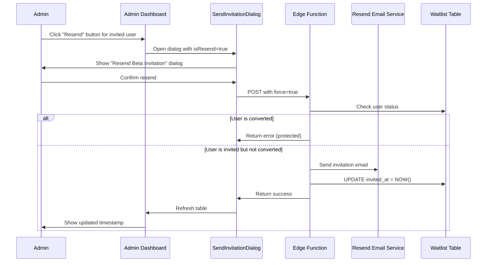
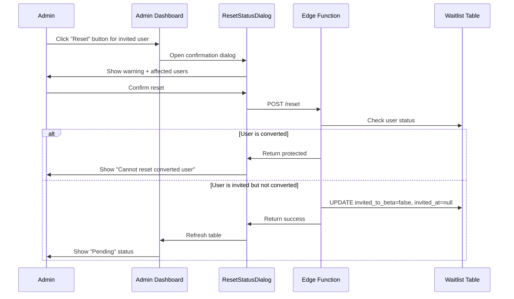

# Waitlist Management Page Enhancements

**Date**: 2025-10-30
**Status**: ✅ Implemented
**Related Plan**: [20251030-waitlist-to-beta-conversion.md](./20251030-waitlist-to-beta-conversion.md)

## Executive Summary

This document describes the enhancements to the admin dashboard's waitlist management page, enabling admins to resend invitations and reset user invitation status. These features provide greater flexibility in managing beta program invitations while protecting users who have already converted to beta.

## Problem Statement

After implementing the initial waitlist-to-beta invitation system, we identified two key usability gaps:

1. **No way to resend invitations**: If a user didn't receive or lost their invitation email, admins had no way to resend it without manual database intervention.

2. **No way to reset invitation status**: If an invitation was sent by mistake or needs to be revoked before the user signs up, admins couldn't reset the status back to "Pending".

3. **Unclear email template location**: Team members needed guidance on where to edit the invitation email content.

## Solution Overview

### Email Template Location (Documentation)

The invitation email template exists in **two synchronized locations**:

1. **Backend (Actual email sent)**:
   - File: `supabase/functions/send-beta-invitation/emails/beta-invitation.tsx`
   - Lines: 19-66 (translations object)
   - Uses React Email components for rendering
   - This is the authoritative source that gets sent

2. **Frontend (Preview only)**:
   - File: `apps/admin-dashboard/components/EmailPreviewDialog.tsx`
   - Lines: 36-85 (translations object)
   - Must be kept in sync with backend manually
   - Used for admin preview before sending

**Important**: When editing email content, update **both files** to maintain consistency between preview and actual emails.

### Feature Implementation

#### 1. Resend Invitation
- **Purpose**: Resend invitation email to users who are already invited
- **Behavior**:
  - Sends a new email with the same content
  - Updates `invited_at` timestamp to current time
  - Bypasses "already invited" check using `force` parameter
  - Works for users in "Invited" status (not converted)

#### 2. Reset Invitation Status
- **Purpose**: Reset invitation status back to "Pending"
- **Behavior**:
  - Clears `invited_to_beta` flag (sets to false)
  - Clears `invited_at` timestamp (sets to null)
  - Shows confirmation dialog before executing
  - Protects converted users from accidental reset

#### 3. Status Protection
- **Protected Users**: Users who have `converted_to_beta = true`
- **Rationale**: Once a user has logged in and been converted to beta, their status should not be modified
- **Enforcement**: Both backend and frontend prevent actions on converted users

## Architecture

### Database Schema (Unchanged)

The existing waitlist table structure supports these features:

```sql
CREATE TABLE public.waitlist (
  id BIGINT PRIMARY KEY,
  email TEXT NOT NULL UNIQUE,
  created_at TIMESTAMPTZ NOT NULL DEFAULT NOW(),

  -- Beta invitation tracking
  invited_to_beta BOOLEAN DEFAULT FALSE,
  invited_at TIMESTAMPTZ,
  converted_to_beta BOOLEAN DEFAULT FALSE,
  converted_at TIMESTAMPTZ
);
```

### Backend API Endpoints

#### POST /send-beta-invitation (Enhanced)

**Request**:
```json
{
  "emails": ["user@example.com"],
  "locale": "en",
  "force": true  // NEW: Bypass already-invited check
}
```

**Behavior with `force: true`**:
- Skips "already invited" check
- Sends email even if `invited_to_beta = true`
- Updates `invited_at` timestamp to current time
- Still protects converted users

**Response**: (same as before)
```json
{
  "message": "Beta invitation process completed",
  "summary": {
    "total": 1,
    "successful": 1,
    "failed": 0,
    "alreadyInvited": 0
  },
  "results": {
    "success": ["user@example.com"],
    "failed": [],
    "alreadyInvited": [],
    "immediatelyUpgraded": []
  }
}
```

#### POST /send-beta-invitation/reset (NEW)

**Purpose**: Reset invitation status for users

**Request**:
```json
{
  "emails": ["user@example.com"]
}
```

**Response**:
```json
{
  "message": "Reset invitation process completed",
  "summary": {
    "total": 1,
    "successful": 1,
    "failed": 0,
    "protected": 0
  },
  "results": {
    "success": ["user@example.com"],
    "failed": [],
    "protected": []  // Converted users that cannot be reset
  }
}
```

**Protection Logic**:
```typescript
// Protect converted users - cannot be reset
if (waitlistRecord.converted_to_beta) {
  results.protected.push(email);
  continue;
}
```

### Frontend Components

#### WaitlistTable.tsx (Enhanced)

**New UI Logic**:
```typescript
// Status: Pending (not invited, not converted)
→ Show "Send" button

// Status: Invited (invited but not converted)
→ Show "Resend" button
→ Show "Reset" button

// Status: Converted (converted to beta)
→ Show "No actions available" message
```

**Visual Design**:
- "Send" button: Primary action for pending users
- "Resend" button: RefreshCw icon, indicates repeating action
- "Reset" button: RotateCcw icon, indicates reversing action
- All buttons use outline variant for consistency

#### SendInvitationDialog.tsx (Enhanced)

**New Props**:
```typescript
interface SendInvitationDialogProps {
  emails: string[];
  isOpen: boolean;
  onOpenChange: (open: boolean) => void;
  onInvitationSent: () => void;
  isResend?: boolean;  // NEW: Indicates resend mode
}
```

**Conditional Rendering**:
```typescript
// Title
isResend ? "Resend Beta Invitation" : "Send Beta Invitation"

// Description
isResend
  ? "Resend beta invitation emails to N users. This will update the invitation timestamp."
  : "Send beta invitation emails to N users."

// Button
isResend ? "Resend Invitations" : "Send Invitations"

// Success message
isResend
  ? "Successfully resent N invitations"
  : "Successfully sent N invitations"
```

#### ResetStatusDialog.tsx (NEW)

**Purpose**: Confirmation dialog for destructive reset action

**Features**:
- Warning alert with AlertTriangle icon
- Clear explanation of consequences
- List of affected users
- "Cancel" and "Confirm Reset" buttons
- Result display with success/failed/protected categories

**User Experience**:
- Always requires explicit confirmation
- Cannot be bypassed or auto-accepted
- Shows clear feedback after execution
- Auto-closes on complete success after 2 seconds

## User Workflows

### Workflow 1: Resend Invitation



### Workflow 2: Reset Invitation Status



## Design Decisions

### 1. Show Send → Resend/Reset Pattern

**Decision**: Show different buttons based on user status rather than always showing all actions.

**Rationale**:
- Clearer user intent: "Send" vs "Resend" communicates different actions
- Reduces clutter: Only show relevant actions per row
- Prevents accidental mistakes: Can't send to already-invited users

**Alternative Considered**: Single "Send Invitation" button with smart behavior
- ❌ Rejected: Doesn't communicate resend behavior clearly
- ❌ Rejected: Admins wouldn't know if action is send or resend

### 2. Update Timestamp on Resend

**Decision**: Update `invited_at` to current timestamp when resending.

**Rationale**:
- Reflects actual last invitation time
- Useful for tracking when last contact was made
- Helps identify stale invitations (invited long ago, not converted)

**Alternative Considered**: Keep original timestamp
- ❌ Rejected: Loses information about when last email was sent
- ❌ Rejected: Can't differentiate first invitation from resends

### 3. Protect Converted Users

**Decision**: Prevent any status changes for users with `converted_to_beta = true`.

**Rationale**:
- Data integrity: Don't break users who are already using beta
- Prevent accidental downgrades: Can't accidentally remove beta access
- Clear system state: Converted users are in a final, stable state

**Alternative Considered**: Allow resetting converted users
- ❌ Rejected: Risk of breaking active beta users
- ❌ Rejected: Complicates role management logic

### 4. Require Confirmation for Reset

**Decision**: Show explicit confirmation dialog before resetting status.

**Rationale**:
- Destructive action: Clears invitation data permanently
- Prevents mistakes: Admins must consciously confirm
- Clear consequences: Dialog explains what will happen

**Alternative Considered**: Direct reset without confirmation
- ❌ Rejected: Too easy to click by mistake
- ❌ Rejected: Doesn't communicate consequences clearly

### 5. Keep Both Resend and Reset Buttons

**Decision**: Show both "Resend" and "Reset" buttons for invited users.

**Rationale**:
- Different use cases: Resend for lost emails, reset for mistakes
- Clear actions: Each button has single, clear purpose
- Flexible management: Admins can choose appropriate action

**Alternative Considered**: Combined "Manage Invitation" menu
- ❌ Rejected: Adds extra click for common actions
- ❌ Rejected: Less discoverable than explicit buttons

## Testing Procedures

### Test Case 1: Resend Invitation to Invited User

**Prerequisites**:
- User in waitlist with `invited_to_beta = true`
- User not converted (`converted_to_beta = false`)

**Steps**:
1. Navigate to admin dashboard waitlist page
2. Find invited user in table
3. Click "Resend" button
4. Verify dialog shows "Resend Beta Invitation" title
5. Confirm resend action
6. Verify success message shown
7. Verify new email sent (check Resend dashboard)
8. Verify `invited_at` timestamp updated

**Expected Result**:
- Email sent successfully
- `invited_at` updated to current timestamp
- `invited_to_beta` remains true
- Table shows updated timestamp

**SQL Verification**:
```sql
SELECT email, invited_to_beta, invited_at, converted_to_beta
FROM waitlist
WHERE email = 'test@example.com';
-- Expected: invited_at is recent timestamp
```

### Test Case 2: Reset Invitation Status

**Prerequisites**:
- User in waitlist with `invited_to_beta = true`
- User not converted (`converted_to_beta = false`)

**Steps**:
1. Navigate to admin dashboard waitlist page
2. Find invited user in table
3. Click "Reset" button
4. Verify warning dialog shown
5. Read consequences message
6. Click "Confirm Reset"
7. Verify success message
8. Verify table refreshes

**Expected Result**:
- Dialog shows warning about consequences
- Reset processes successfully
- `invited_to_beta` set to false
- `invited_at` set to null
- User status shows "Pending" badge
- "Send" button now visible

**SQL Verification**:
```sql
SELECT email, invited_to_beta, invited_at, converted_to_beta
FROM waitlist
WHERE email = 'test@example.com';
-- Expected: invited_to_beta=false, invited_at=null
```

### Test Case 3: Protect Converted Users

**Prerequisites**:
- User with `converted_to_beta = true`

**Steps**:
1. Navigate to admin dashboard waitlist page
2. Find converted user in table
3. Verify no "Resend" or "Reset" buttons shown
4. Verify "No actions available" message displayed
5. Attempt direct API call to reset (via curl/Postman)

**Expected Result**:
- UI shows "No actions available"
- No action buttons rendered
- API call returns error: "User has already converted to beta and cannot be modified"
- Database unchanged

**SQL Verification**:
```sql
-- Before and after should be identical
SELECT email, invited_to_beta, invited_at, converted_to_beta, converted_at
FROM waitlist
WHERE email = 'converted@example.com';
```

### Test Case 4: Resend Updates Timestamp

**Prerequisites**:
- User invited 7 days ago

**Steps**:
1. Note current `invited_at` timestamp
2. Click "Resend" button
3. Confirm resend
4. Note new `invited_at` timestamp

**Expected Result**:
- New timestamp is current time (within 1 second)
- Old timestamp is replaced (not preserved)

**SQL Verification**:
```sql
-- Before resend
SELECT invited_at FROM waitlist WHERE email = 'test@example.com';
-- Example: 2025-10-23 10:00:00

-- After resend (should be current time)
SELECT invited_at FROM waitlist WHERE email = 'test@example.com';
-- Example: 2025-10-30 15:30:00
```

### Test Case 5: Email Template Synchronization

**Prerequisites**:
- Access to both backend and frontend template files

**Steps**:
1. Read `supabase/functions/send-beta-invitation/emails/beta-invitation.tsx` lines 19-66
2. Read `apps/admin-dashboard/components/EmailPreviewDialog.tsx` lines 36-85
3. Compare translations objects
4. Verify all keys and values match
5. Edit one field in backend template
6. Update corresponding field in frontend preview
7. Test preview dialog matches actual email

**Expected Result**:
- Both files have identical content for all fields
- Preview shows exact same content as email
- Changes to one file reflected in the other

## Troubleshooting

### Issue 1: Resend Button Not Showing

**Symptoms**: User is invited but no resend button appears.

**Diagnosis**:
```sql
SELECT email, invited_to_beta, converted_to_beta
FROM waitlist
WHERE email = 'user@example.com';
```

**Possible Causes**:
1. User is converted: `converted_to_beta = true`
2. Database not updated: `invited_to_beta = false` despite invitation
3. Frontend not refreshed: Stale state in React component

**Solutions**:
1. Verify user is invited but not converted
2. Manually refresh the page (hard reload: Cmd+Shift+R)
3. Check database directly for correct status
4. If data is correct, check browser console for errors

### Issue 2: Reset Fails Silently

**Symptoms**: Click "Confirm Reset" but status doesn't change.

**Diagnosis**:
1. Open browser developer console (F12)
2. Go to Network tab
3. Click "Confirm Reset"
4. Look for POST request to `/send-beta-invitation/reset`
5. Check response status and body

**Possible Causes**:
1. Network error: Request didn't reach server
2. Authentication error: Invalid or expired token
3. Permission error: User doesn't have admin role
4. Protected user: User has already converted

**Solutions**:
1. Check network request succeeded (200 status)
2. Verify Supabase session is active (log in again if needed)
3. Verify user has admin role in profiles table
4. Check response body for specific error message

### Issue 3: Converted Users Still Editable

**Symptoms**: Resend/Reset buttons appear for converted users.

**Diagnosis**:
```sql
SELECT id, email, invited_to_beta, converted_to_beta
FROM waitlist
WHERE email = 'converted@example.com';
```

**Possible Causes**:
1. Database inconsistency: `converted_to_beta` not set correctly
2. Frontend cache: Component not re-rendering with fresh data
3. Logic bug: Condition checking wrong field

**Solutions**:
1. Verify `converted_to_beta = true` in database
2. Force refresh the page
3. Clear browser cache and reload
4. Check component code for correct conditional rendering:
   ```typescript
   {user.invited_to_beta && !user.converted_to_beta && (
     <Button>Resend</Button>
   )}
   ```

### Issue 4: Email Template Out of Sync

**Symptoms**: Preview shows different content than actual email.

**Diagnosis**:
1. Compare backend template: `supabase/functions/send-beta-invitation/emails/beta-invitation.tsx`
2. Compare frontend preview: `apps/admin-dashboard/components/EmailPreviewDialog.tsx`
3. Look for mismatched translations

**Solutions**:
1. Open both files side by side
2. Compare `translations` object line by line
3. Copy changes from one file to the other
4. Test preview matches email by sending to test account

## Security Considerations

### Authentication & Authorization

- ✅ All endpoints protected by `withRBAC("admin:read_users")` middleware
- ✅ Only users with `admin` role can access features
- ✅ Supabase auth session required for all API calls
- ✅ JWT validation on every request

### Data Protection

- ✅ Converted users cannot be modified (enforced backend + frontend)
- ✅ Reset action requires explicit confirmation
- ✅ Force flag only works for non-converted users
- ✅ All actions logged with admin user ID (via JWT)

### Audit Trail

- ✅ Every invitation tracked with timestamp
- ✅ Reset actions visible through status change
- ✅ Edge function logs all actions
- ✅ Database triggers log conversion events

### Rate Limiting

**Current**: No rate limiting implemented.

**Recommendation**: Add rate limiting to prevent:
- Spam resending to same user
- Accidental bulk actions
- Email quota exhaustion

**Implementation** (Future):
```sql
CREATE TABLE admin_action_rate_limits (
  admin_id UUID,
  action_type TEXT,
  executed_at TIMESTAMPTZ,
  CONSTRAINT unique_action_per_minute UNIQUE (admin_id, action_type, date_trunc('minute', executed_at))
);
```

## Implementation Files

### Backend Changes

1. **`supabase/functions/send-beta-invitation/index.ts`**
   - Added `force` parameter to `handleSendInvitation()`
   - Added protection for converted users
   - Added `handleResetInvitation()` function
   - Added `/reset` endpoint route
   - Enhanced error messages

### Frontend Changes

1. **`apps/admin-dashboard/components/ResetStatusDialog.tsx`** (NEW)
   - Confirmation dialog for reset action
   - Warning message with consequences
   - Success/failed/protected result display
   - Auto-close on complete success

2. **`apps/admin-dashboard/components/WaitlistTable.tsx`**
   - Added state for reset dialog and resend mode
   - Updated Actions column with conditional rendering
   - Added "Resend" and "Reset" buttons
   - Added handlers for resend and reset actions
   - Integrated ResetStatusDialog component

3. **`apps/admin-dashboard/components/SendInvitationDialog.tsx`**
   - Added `isResend` prop
   - Conditional title/description based on resend mode
   - Pass `force: true` when resending
   - Updated button text and success messages

## Related Documentation

- [Waitlist-to-Beta Auto-Conversion](./20251030-waitlist-to-beta-conversion.md) - Initial invitation system
- [Architecture Overview](../docs/architecture/overview.md) - System architecture and RBAC
- [Admin Dashboard Guide](../apps/admin-dashboard/README.md) - Admin interface documentation

## Future Enhancements

### 1. Bulk Resend

**Feature**: Select multiple invited users and resend invitations in batch.

**Implementation**:
- Modify batch selection to include invited users
- Update button text: "Resend Invitations (N)"
- Use existing bulk send logic with `force: true`

### 2. Invitation History

**Feature**: Track all invitation attempts with full history.

**Implementation**:
```sql
CREATE TABLE invitation_history (
  id BIGSERIAL PRIMARY KEY,
  waitlist_id BIGINT REFERENCES waitlist(id),
  sent_at TIMESTAMPTZ NOT NULL,
  sent_by UUID REFERENCES auth.users(id),
  action_type TEXT, -- 'send', 'resend', 'reset'
  locale TEXT
);
```

### 3. Scheduled Reminders

**Feature**: Auto-resend invitations to users who haven't converted after N days.

**Implementation**:
- Cron job checks `invited_at` vs `converted_at`
- Auto-resend after 7 days if not converted
- Track reminder attempts to avoid spam

### 4. Email Delivery Status

**Feature**: Track email delivery status (delivered, bounced, opened).

**Implementation**:
- Integrate Resend webhook events
- Store delivery status in waitlist table
- Show status in admin dashboard
- Alert on high bounce rates

## Commit Messages

All commits follow conventional commit format:

1. **Backend endpoints**: `Feat(backend): Add waitlist status management endpoints with resend and reset capabilities`
2. **Reset dialog**: `Feat(admin): Add confirmation dialog for waitlist status reset actions`
3. **Table UI**: `Feat(admin): Add resend and reset buttons to waitlist management table`
4. **Dialog updates**: `Feat(admin): Update invitation dialog to support resend functionality`
5. **Documentation**: `Docs(admin): Document waitlist management page enhancements`

## Conclusion

The waitlist management page now provides comprehensive tools for managing beta invitations:

- ✅ **Resend capability** - Easily resend invitations when needed
- ✅ **Reset functionality** - Revert mistaken invitations before user signup
- ✅ **Status protection** - Converted users cannot be accidentally modified
- ✅ **Clear documentation** - Email template location clearly documented
- ✅ **User-friendly UI** - Intuitive buttons with clear labels and icons
- ✅ **Safe operations** - Confirmation dialogs for destructive actions

The system maintains data integrity while providing flexibility for admin users to manage the beta program effectively.

## Document Updates

| Date | Version | Changes |
|------|---------|---------|
| 2025-10-30 | 1.0 | Initial documentation created |
