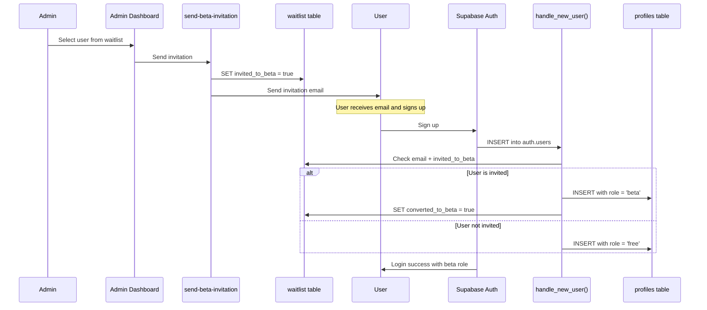
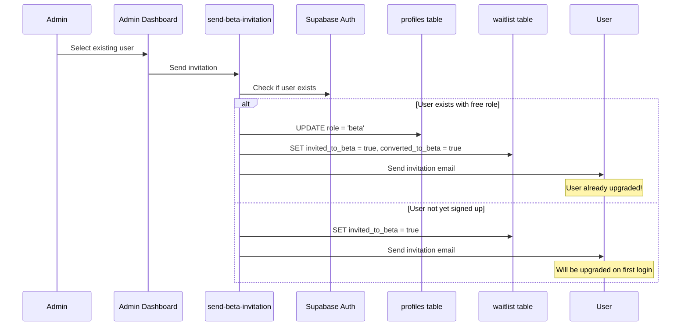

# Waitlist-to-Beta Auto-Conversion System

**Date**: 2025-10-30
**Status**: ✅ Implemented and Active
**Implementation Approach**: Database Trigger (Option 1)

## Executive Summary

This document describes the automatic beta user conversion system that promotes waitlist users to beta tier when they first log in. The system uses a database trigger approach for zero-latency, atomic operations without requiring any application changes.

## Problem Statement

When releasing Knovy's beta version, we need to automatically convert invited waitlist users from the "free" role to "beta" role upon their first login, while keeping regular users on the free tier.

## Solution Architecture

### Selected Approach: Database Trigger (Option 1)

We chose **Option 1** for its optimal characteristics:

- ✅ **Zero latency** - Happens during profile creation trigger
- ✅ **No app changes needed** - Pure database-side logic
- ✅ **Atomic operation** - Transaction-safe with profile creation
- ✅ **Immediate effect** - Users get beta role on first login
- ✅ **Audit trail** - Tracks conversion timestamps
- ✅ **Edge case handling** - Upgrades existing users when invited

### Alternatives Considered

**Option 2: Edge Function (Rejected)**
- ❌ Adds latency to login process
- ❌ Requires app changes to call function
- ❌ More complex error handling needed

**Option 3: Cron Job (Rejected)**
- ❌ Not immediate - users may be blocked temporarily
- ❌ More complex scheduling and monitoring needed

## Implementation Details

### Database Schema

#### Waitlist Table Structure
```sql
CREATE TABLE public.waitlist (
  id BIGINT PRIMARY KEY,
  email TEXT NOT NULL UNIQUE,
  created_at TIMESTAMPTZ NOT NULL DEFAULT NOW(),

  -- Beta invitation tracking (added in 20251028120000)
  invited_to_beta BOOLEAN DEFAULT FALSE,
  invited_at TIMESTAMPTZ,
  converted_to_beta BOOLEAN DEFAULT FALSE,
  converted_at TIMESTAMPTZ
);

-- Performance indexes
CREATE INDEX idx_waitlist_email_invited
  ON public.waitlist(email, invited_to_beta);

CREATE INDEX idx_waitlist_invited_to_beta
  ON public.waitlist(invited_to_beta)
  WHERE invited_to_beta = true;
```

### Auto-Conversion Trigger

**File**: `supabase/migrations/20251028130000_enhance_auto_beta_conversion.sql`

```sql
CREATE OR REPLACE FUNCTION public.handle_new_user()
RETURNS TRIGGER AS $$
DECLARE
  v_email TEXT;
  v_waitlist_record RECORD;
BEGIN
  -- Get user email from auth.users
  v_email := NEW.email;

  -- Check waitlist for invitation status
  SELECT id, email, invited_to_beta, converted_to_beta
  INTO v_waitlist_record
  FROM public.waitlist
  WHERE email = v_email
    AND invited_to_beta = true
    AND converted_to_beta = false;

  IF FOUND THEN
    -- Create profile with beta role
    INSERT INTO public.profiles (id, role)
    VALUES (NEW.id, 'beta');

    -- Mark as converted with timestamp
    UPDATE public.waitlist
    SET converted_to_beta = true,
        converted_at = NOW()
    WHERE email = v_email;

    RAISE NOTICE 'Auto-converted user % to beta role', v_email;
  ELSE
    -- Create profile with default free role
    INSERT INTO public.profiles (id, role)
    VALUES (NEW.id, 'free');
  END IF;

  RETURN NEW;
END;
$$ LANGUAGE plpgsql SECURITY DEFINER;

-- Attach trigger to auth.users
CREATE TRIGGER on_auth_user_created
  AFTER INSERT ON auth.users
  FOR EACH ROW
  EXECUTE FUNCTION public.handle_new_user();
```

## System Flow Diagrams

### Flow 1: New User with Invitation



### Flow 2: Existing User Gets Invited



## Admin Workflow

### Inviting Users to Beta

1. **Access Admin Dashboard**
   - Navigate to admin dashboard (requires `admin` role)
   - View Waitlist Management page

2. **Review Waitlist**
   - See all waitlist users with status:
     - **Pending**: Not yet invited
     - **Invited**: Invitation sent, awaiting login
     - **Converted**: User logged in and converted to beta

3. **Select Users**
   - Use checkboxes to select one or multiple users
   - Or click "Send" button for individual users

4. **Send Invitations**
   - Click "Send Invitations (N)" button
   - Review email preview if needed
   - Confirm and send

5. **Monitor Conversions**
   - Track conversion status in real-time
   - View conversion timestamps
   - See statistics: Total, Invited, Converted, Pending

## Edge Cases Handled

### 1. User Already Has Account (Free Role)
**Scenario**: User signed up before being invited to beta.

**Handling**:
- `send-beta-invitation` function immediately upgrades user from free → beta
- Marks as `converted_to_beta = true`
- User sees beta features on next login

### 2. User Has Higher Role
**Scenario**: User is already `pro` or `admin`.

**Handling**:
- Skip upgrade (don't downgrade)
- Still send invitation email for informational purposes

### 3. User Already Invited
**Scenario**: Admin tries to invite same user twice.

**Handling**:
- Check `invited_to_beta` flag
- Skip invitation, show "Already invited" status
- Display original invitation timestamp

### 4. Waitlist Email Not Found
**Scenario**: Admin tries to invite email not in waitlist.

**Handling**:
- Return error: "Email not found in waitlist"
- Prevent invitation without waitlist entry

## Testing Procedures

### Test Case 1: New User with Invitation

**Prerequisites**:
- Admin access to dashboard
- Test email in waitlist

**Steps**:
1. Admin selects user from waitlist
2. Admin sends beta invitation
3. Test user signs up with invited email
4. Verify profile created with `role = 'beta'`
5. Verify `converted_to_beta = true` in waitlist table

**Expected Result**:
```sql
-- Check profiles table
SELECT id, role FROM profiles WHERE email = 'test@example.com';
-- Expected: role = 'beta'

-- Check waitlist table
SELECT invited_to_beta, converted_to_beta, converted_at
FROM waitlist WHERE email = 'test@example.com';
-- Expected: invited_to_beta = true, converted_to_beta = true, converted_at = (timestamp)
```

### Test Case 2: Existing User Gets Invited

**Prerequisites**:
- User already signed up with `role = 'free'`
- User email in waitlist

**Steps**:
1. Verify user has free role
2. Admin sends beta invitation to user
3. Verify role immediately upgraded to beta
4. User logs in and sees beta features

**Expected Result**:
```sql
-- Before invitation
SELECT role FROM profiles WHERE email = 'test@example.com';
-- Expected: role = 'free'

-- After invitation (immediate)
SELECT role FROM profiles WHERE email = 'test@example.com';
-- Expected: role = 'beta'

-- Waitlist updated
SELECT converted_to_beta, converted_at FROM waitlist WHERE email = 'test@example.com';
-- Expected: converted_to_beta = true, converted_at = (timestamp)
```

### Test Case 3: Regular User (No Invitation)

**Prerequisites**:
- Email NOT in waitlist OR not invited

**Steps**:
1. User signs up with email not in waitlist
2. Verify profile created with `role = 'free'`

**Expected Result**:
```sql
SELECT role FROM profiles WHERE email = 'regular@example.com';
-- Expected: role = 'free'
```

### Test Case 4: Double Invitation Prevention

**Prerequisites**:
- User already invited to beta

**Steps**:
1. Admin tries to invite same user again
2. Verify system shows "Already invited" status
3. Verify no duplicate invitations sent

**Expected Result**:
- UI shows badge: "Invited" with checkmark
- Button disabled or hidden
- No duplicate emails sent

## Verification Checklist

### Database Migrations

- [ ] `20251028120000_add_beta_invitation_tracking.sql` applied to production
- [ ] `20251028130000_enhance_auto_beta_conversion.sql` applied to production
- [ ] Verify trigger `on_auth_user_created` exists on `auth.users`
- [ ] Verify function `handle_new_user()` definition is correct
- [ ] Verify indexes exist on waitlist table

**Verification SQL**:
```sql
-- Check trigger exists
SELECT * FROM information_schema.triggers
WHERE trigger_name = 'on_auth_user_created';

-- Check function exists
SELECT proname, prosrc
FROM pg_proc
WHERE proname = 'handle_new_user';

-- Check indexes
SELECT indexname, indexdef
FROM pg_indexes
WHERE tablename = 'waitlist';

-- Check waitlist columns
SELECT column_name, data_type
FROM information_schema.columns
WHERE table_name = 'waitlist'
  AND column_name IN ('invited_to_beta', 'invited_at', 'converted_to_beta', 'converted_at');
```

### Admin Dashboard

- [ ] Waitlist Management page loads correctly
- [ ] Shows all waitlist users with proper status badges
- [ ] Selection checkboxes work for uninvited users
- [ ] "Send Invitations" button appears when users selected
- [ ] Email preview dialog shows correct template
- [ ] Individual "Send" buttons work
- [ ] Statistics display correctly (Total, Invited, Converted, Pending)

### Edge Function

- [ ] `send-beta-invitation` function deployed
- [ ] RBAC protection requires `admin:read_users` entitlement
- [ ] GET `/waitlist` endpoint returns all users with status
- [ ] POST `/` endpoint accepts email array
- [ ] Resend API key configured correctly
- [ ] Invitation emails send successfully
- [ ] Immediate upgrade works for existing users

## Monitoring and Analytics

### Key Metrics to Track

1. **Conversion Rate**
   - Invited users / Total waitlist
   - Converted users / Invited users
   - Time from invitation to conversion

2. **System Health**
   - Trigger execution success rate
   - Profile creation errors
   - Email delivery success rate

3. **User Behavior**
   - Time to sign up after invitation
   - Beta feature adoption rate
   - User retention by conversion path

### Recommended Queries

**Daily Conversion Report**:
```sql
SELECT
  DATE(created_at) as date,
  COUNT(*) as total_waitlist,
  COUNT(*) FILTER (WHERE invited_to_beta) as invited,
  COUNT(*) FILTER (WHERE converted_to_beta) as converted,
  ROUND(COUNT(*) FILTER (WHERE converted_to_beta)::numeric /
        NULLIF(COUNT(*) FILTER (WHERE invited_to_beta), 0) * 100, 2) as conversion_rate
FROM waitlist
GROUP BY DATE(created_at)
ORDER BY date DESC
LIMIT 30;
```

**Average Time to Conversion**:
```sql
SELECT
  AVG(EXTRACT(EPOCH FROM (converted_at - invited_at)) / 3600) as avg_hours_to_convert,
  MIN(converted_at - invited_at) as fastest_conversion,
  MAX(converted_at - invited_at) as slowest_conversion
FROM waitlist
WHERE invited_to_beta = true AND converted_to_beta = true;
```

**Pending Invitations**:
```sql
SELECT
  email,
  invited_at,
  EXTRACT(EPOCH FROM (NOW() - invited_at)) / 3600 as hours_since_invitation
FROM waitlist
WHERE invited_to_beta = true
  AND converted_to_beta = false
ORDER BY invited_at DESC;
```

## Troubleshooting

### Issue 1: User Not Auto-Converted to Beta

**Symptoms**: User logs in but still has free role despite invitation.

**Diagnosis**:
```sql
-- Check waitlist status
SELECT email, invited_to_beta, converted_to_beta
FROM waitlist
WHERE email = 'user@example.com';

-- Check profile
SELECT id, role, created_at
FROM profiles
WHERE id = (SELECT id FROM auth.users WHERE email = 'user@example.com');

-- Check trigger exists
SELECT * FROM pg_trigger WHERE tgname = 'on_auth_user_created';
```

**Solutions**:
1. Verify user email matches waitlist exactly (case-sensitive)
2. Confirm `invited_to_beta = true` in waitlist
3. Check trigger is enabled and function exists
4. Review database logs for trigger errors
5. Manually upgrade user if needed:
   ```sql
   UPDATE profiles
   SET role = 'beta', updated_at = NOW()
   WHERE id = (SELECT id FROM auth.users WHERE email = 'user@example.com');
   ```

### Issue 2: Invitation Email Not Sent

**Symptoms**: Admin sends invitation but user doesn't receive email.

**Diagnosis**:
```sql
-- Check waitlist updated
SELECT invited_to_beta, invited_at
FROM waitlist
WHERE email = 'user@example.com';
```

**Solutions**:
1. Verify Resend API key is configured
2. Check edge function logs for errors
3. Verify email is valid format
4. Check spam folder
5. Resend invitation from admin dashboard

### Issue 3: Existing User Not Immediately Upgraded

**Symptoms**: User has free role, gets invited, but role doesn't change.

**Diagnosis**:
```sql
-- Check if upgrade logic ran
SELECT role, updated_at
FROM profiles
WHERE id = (SELECT id FROM auth.users WHERE email = 'user@example.com');
```

**Solutions**:
1. Check edge function logs for upgrade errors
2. Verify user profile exists (not just auth.users)
3. Manually trigger upgrade:
   ```sql
   UPDATE profiles
   SET role = 'beta', updated_at = NOW()
   WHERE id = (SELECT id FROM auth.users WHERE email = 'user@example.com');

   UPDATE waitlist
   SET converted_to_beta = true, converted_at = NOW()
   WHERE email = 'user@example.com';
   ```

### Issue 4: Trigger Not Firing

**Symptoms**: New users created but trigger doesn't execute.

**Diagnosis**:
```sql
-- Check trigger definition
SELECT tgname, tgenabled, tgtype
FROM pg_trigger
WHERE tgname = 'on_auth_user_created';

-- Check function exists
SELECT proname FROM pg_proc WHERE proname = 'handle_new_user';
```

**Solutions**:
1. Reapply migration:
   ```bash
   pnpm dlx supabase db push
   ```
2. Manually create trigger if missing:
   ```sql
   CREATE TRIGGER on_auth_user_created
     AFTER INSERT ON auth.users
     FOR EACH ROW
     EXECUTE FUNCTION public.handle_new_user();
   ```

## Optional Improvements

### 1. Monitoring Dashboard

**Feature**: Real-time admin dashboard for conversion metrics.

**Implementation**:
- Add analytics component to admin dashboard
- Show conversion funnel visualization
- Display time-to-conversion graphs
- Alert on stuck conversions (invited but not converted > 7 days)

### 2. Email Notification on Conversion

**Feature**: Send confirmation email when user is auto-converted.

**Implementation**:
- Add notification edge function
- Trigger on `converted_to_beta = true`
- Welcome user to beta program
- Provide onboarding resources

### 3. Conversion Rate Alerts

**Feature**: Alert admins if conversion rate drops below threshold.

**Implementation**:
- Daily cron job to calculate conversion rate
- Send alert if rate < 50% for users invited > 7 days ago
- Help identify potential issues early

### 4. A/B Testing for Invitation Emails

**Feature**: Test different email templates to optimize conversion.

**Implementation**:
- Create multiple email templates
- Randomly assign template variant
- Track which variant has better conversion rate
- Use winning template for all invitations

## Security Considerations

### Data Access

- ✅ Waitlist table has RLS enabled
- ✅ Only admins can view/update waitlist
- ✅ Trigger uses `SECURITY DEFINER` for elevated privileges
- ✅ Email addresses never exposed to unauthorized users

### Audit Trail

- ✅ All invitations logged with timestamps
- ✅ All conversions tracked with timestamps
- ✅ Admin actions can be traced through edge function logs
- ✅ Database trigger actions logged via RAISE NOTICE

### Rate Limiting

**Current**: No rate limiting on invitation sending.

**Recommendation**: Add rate limiting to prevent:
- Accidental mass invitations
- Admin account compromise abuse
- Email provider quota exhaustion

**Implementation**:
```sql
-- Add rate limiting table
CREATE TABLE invitation_rate_limits (
  admin_id UUID,
  invited_at TIMESTAMPTZ,
  email TEXT
);

-- Check rate limit in edge function
-- Max 100 invitations per admin per hour
```

## Migration History

| Migration | Date | Description |
|-----------|------|-------------|
| `20250825112617_consolidated_waitlist.sql` | 2025-08-25 | Created waitlist table with basic structure |
| `20251028120000_add_beta_invitation_tracking.sql` | 2025-10-28 | Added invitation tracking fields |
| `20251028130000_enhance_auto_beta_conversion.sql` | 2025-10-28 | Implemented auto-conversion trigger |

## Related Documentation

- [Architecture Overview](../docs/architecture/overview.md) - System architecture and RBAC
- [Admin Dashboard Guide](../apps/admin-dashboard/README.md) - Admin interface documentation
- [Supabase Edge Functions](../supabase/functions/README.md) - Backend API documentation

## Conclusion

The waitlist-to-beta auto-conversion system is fully implemented and operational. It provides:

- ✅ **Seamless user experience** - Zero friction for invited users
- ✅ **Admin control** - Granular invitation management
- ✅ **Auditability** - Complete tracking of invitation and conversion lifecycle
- ✅ **Reliability** - Database-level guarantees with atomic operations
- ✅ **Scalability** - Efficient indexing and trigger-based architecture

The system is production-ready and requires only verification that migrations are applied and testing of the end-to-end flow.

## Document Updates

| Date | Version | Changes |
|------|---------|---------|
| 2025-10-30 | 1.0 | Initial documentation created |
